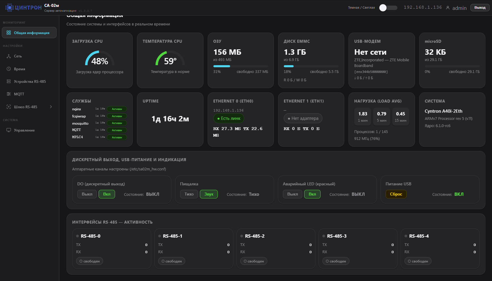

# СА-02м — Web Interface

<p align="center">
  
  
  
  
</p>

Веб-интерфейс для **[сервера автоматизации СА-02м](https://cyntron.ru/catalog/ustroystva_avtomatizatsii/servery_avtomatizatsii/)** производства [ЦИНТРОН](https://cyntron.ru) на базе процессорного модуля [A40i-2eth](https://cyntron.ru/catalog/ustroystva_avtomatizatsii/komplektuyushchie/7705/) (Allwinner A40i, Linux).

| Устройство | Описание | Ссылка |
|-----------|----------|--------|
| **СА-02м** | 5×RS-485, DO, uSD, USB, RTC, 1×Eth | [cyntron.ru](https://cyntron.ru/catalog/ustroystva_avtomatizatsii/servery_avtomatizatsii/) |
| **СА-02м-2** | 4×RS-485, uSD, USB, RTC, 2×Eth | [cyntron.ru](https://cyntron.ru/catalog/ustroystva_avtomatizatsii/servery_avtomatizatsii/) |
| **A40i-2eth** | Процессорный модуль (SoM), производство Россия | [cyntron.ru](https://cyntron.ru/catalog/ustroystva_avtomatizatsii/komplektuyushchie/7705/) |

### Аппаратные варианты SA-02m / SA-02m-2

Установщик и образ **универсальны** — вариант определяется автоматически по числу физических Ethernet-интерфейсов.

| Параметр | SA-02m (1-eth) | SA-02m-2 (2-eth) |
|---|---|---|
| Ethernet | 1 порт (eth0) | 2 порта (eth0 + eth1) |
| IP eth0 по умолчанию | `192.168.1.136` | `192.168.0.136` |
| Шлюз по умолчанию | `192.168.1.1` | `192.168.0.1` |
| eth1 | — | DHCP (metric 100) |
| COM-портов | 5 (ttyS0+S3+S4+S5+S7) | 4 (ttyS3+S4+S5+S7) |
| Serial профиль | `sa02m-1eth` | `sa02m-2eth` |
| Конфиг варианта | `/etc/sa02m_hw_variant.conf` | то же |

Вариант можно задать явно при установке:

```bash
sudo ./install.sh --variant sa02m-1eth   # SA-02m  (1 Ethernet)
sudo ./install.sh --variant sa02m-2eth   # SA-02m-2 (2 Ethernet)
```

Или записать в файл вручную:

```bash
echo 'SA02M_HW_VARIANT=sa02m-2eth' > /etc/sa02m_hw_variant.conf
```

---

## Содержание

- [Возможности](#возможности)
- [Скриншоты](#скриншоты)
- [Требования](#требования)
- [Установка на СА-02м](#установка-на-са-02м)
  - [Запуск установщика](#запуск-установщика)
  - [Проверка установки](#проверка-установки)
  - [Первый вход](#первый-вход)
- [Параметры установки](#параметры-установки)
- [Структура проекта](#структура-проекта)
- [Описание компонентов](#описание-компонентов)
  - [Dashboard](#dashboard)
  - [Настройки сети](#настройки-сети)
  - [Управление железом (GPIO)](#управление-железом-gpio)
  - [RS-485 интерфейсы](#rs-485-интерфейсы)
  - [Устройства MR-02м (flasher)](#устройства-mr-02м-flasher)
  - [MQTT (Modbus→MQTT)](#mqtt-modbusmqtt)
  - [Шлюз RS-485 → Ethernet](#шлюз-rs-485--ethernet)
  - [Управление системой](#управление-системой)
  - [Страница входа](#страница-входа)
- [CGI API](#cgi-api)
- [Конфигурация GPIO](#конфигурация-gpio)
- [Сборка образа для СА-02м](#сборка-образа-для-са-02м)
  - [Аппаратная платформа](#аппаратная-платформа)
  - [Виртуальная машина для сборки](#виртуальная-машина-для-сборки)
  - [Процесс сборки Buildroot](#процесс-сборки-buildroot)
  - [Прошивка образа на eMMC](#прошивка-образа-на-emmc)
  - [Тиражирование компактного образа SA-02m (web)](#способ-4--тиражирование-компактного-образа-sa-02m-web)
    - [Что понадобится](#способ-4-что-понадобится)
    - [Снятие образа с эталонного устройства](#способ-4-снятие-образа-с-эталонного-устройства)
    - [Заливка образа на новое устройство](#способ-4-заливка-образа-на-новое-устройство)
    - [Проверка после заливки](#способ-4-проверка-после-заливки)
  - [Первоначальная настройка системы](#первоначальная-настройка-системы)
  - [Отключение UART-консоли](#отключение-uart-консоли)
  - [RS-485 и COM симлинки](#rs-485-и-com-симлинки)
  - [GPIO и периферия](#gpio-и-периферия)
  - [RTC (часы реального времени)](#rtc-часы-реального-времени)
- [Сетевой watchdog](#сетевой-watchdog)
- [Структура файлов на устройстве](#структура-файлов-на-устройстве)
- [Обновление](#обновление)
- [Документация (docs/)](#документация-docs)

---

## Возможности

### Мониторинг (Dashboard)
- **Независимые виджеты** — каждый блок обновляется отдельным CGI-запросом и не блокирует остальные
- **Приоритетная загрузка** — CPU, температура, RAM и eMMC приходят первыми
- **Фоновая догрузка после входа** — сеть, uptime, службы, железо, RS-485 и прочие блоки подтягиваются отдельно
- **CPU** — загрузка с историей, модель, частота (с throttle-индикатором), load averages 1/5/15 мин
- **RAM + Swap** — использование памяти, прогресс-бары
- **Температура** — по всем thermal-зонам (zone0, zone1...)
- **Диск** — объём, использование, I/O (read/write байт с загрузки)
- **Uptime** — время работы системы
- **Сеть** — состояние eth0/eth1, RX/TX байт
- **Модель платы** — из `/proc/device-tree/model` (Armbian/Orange Pi)
- **Ядро** — версия Linux
- **Службы** — nginx, fcgiwrap, mplc (со временем работы)
- **RS-485 (5 портов)** — TX/RX, ошибки (FE/PE/OE), индикатор активности
- **Дискретный выход (DO)** — отображение и управление
- **Beeper** — управление пищалкой
- **Аварийный LED** — управление красным светодиодом

### Настройки
- Два Ethernet-интерфейса (eth0, eth1) — статические IP, маска, шлюз, DNS
- Часовой пояс и дата/время
- Перезапуск служб / перезагрузка устройства

### Устройства MR-02м (RS-485)
- **Сканирование COM1–COM5** по Modbus RTU (стандартный адресный режим) и быстрому Modbus (`0xFD 0x46 0x01`, extended scan), подбор скоростей 9600/19200/38400/57600/115200 N1/N2.
- **Таблица найденных устройств** — адрес, серийный номер, сигнатура, версия приложения и бутлоадера, рабочая скорость, флаг «в bootloader».
- **Обновление прошивки MR-02м** — по адресу (`reg 0x1000` + `0x2000`) и по серийному номеру через быстрый Modbus (`0xFD 0x46 0x08`), пакетная прошивка нескольких устройств, автоматический переход в bootloader (`reg 129`) и запуск приложения (`reg 1004`).
- **Координация с опросом** — сервис `mplc.service` и любые другие службы из `MPLC_STOP_SERVICES` в `/etc/sa02m_flasher.conf` автоматически останавливаются на время операции и восстанавливаются после.
- **Backend** — Python-демон `sa02m-flasher` (systemd unit), unix-сокет `/run/sa02m-flasher/flasher.sock`, HTTP API на stdlib, SSE-стрим событий, API-авторизация через тот же session cookie, что и CGI.

### MQTT (Modbus→MQTT мост)
- **Брокер Mosquitto** — локальный порт `1883` (только localhost), внешний `1884` с ACL и пользователем `mqttuser` для подключения SCADA/ПК.
- **Modbus→MQTT мост** (`sa02m-modbus-mqtt.service`) — опрос MR-02м, ДТВ, СЭ-02м-3 по RS-485 и публикация в MQTT (`/devices/<id>/controls/*`).
- **Шаблоны устройств** — 15 JSON-шаблонов в `etc/sa02m-device-templates/` (все варианты MR-02м, ДТВ, CE-02m-3): каналы DO/DI/AO/AI, счётчики импульсов, AI в вольтах как в desktop flasher.
- **Веб-вкладка «MQTT»** — поиск устройств на шине, ручное добавление, настройка каналов, live-значения, монитор топиков (SSE), панель подключения с ПК (пароль маскируется как `******`).
- **Доступность в стиле wb-mqtt-serial** — Last Will, device-level `/meta/error`, экспоненциальный back-off «мёртвых» устройств, статус-устройство `sa02m-bridge`, graceful offline при `systemctl stop`.
- **Системная телеметрия** (`sa02m-telemetry.service`) — CPU, RAM, температура, uptime, DO/Beeper/Alarm LED контроллера в MQTT.
- **Fast Modbus** — мгновенные события DO/DI через extended scan (`0xFD 0x46`).
- **Northbound-драйверы** (опционально): `sa02m-mqtt-snmp` (SNMP→MQTT), `sa02m-mqtt-opcua` (OPC UA→MQTT) — конфиги в `/etc/sa02m-mqtt-snmp.conf`, `/etc/sa02m-mqtt-opcua.conf`.
- **Координация с flasher** — кнопка «Остановить мост» освобождает COM-порт для прошивки/сканирования MR-02м.

### Шлюз RS-485 → Ethernet
- **Сервис `sa02m-serial-gateway`** — преобразование RS-485 портов COM1–COM5 в TCP-сервисы для SCADA и внешних клиентов.
- **Режимы на порт:** `modbus_tcp` (MBAP↔RTU, порты 502–506), `rtu_over_tcp` (сырой RTU без MBAP, 8502–8506), `transparent` (прозрачный serial↔TCP, 9502–9506), `disabled`.
- **Fast Modbus probe** — локальный ответ на Modbus TCP-пробу (`FC 0x47`, `WB-FAST-MODBUS?`) без выхода на RS-485; сканирование и обмен на шине — Fast Modbus `0xFD 0x46` (как в MR-02m / WB).
- **Веб-вкладка «Шлюз RS-485»** — боковое подменю по COM1–COM5, настройка скорости/чётности, статус TCP-клиентов, сохранение в `/etc/sa02m-gateway.yaml`.
- **Эксклюзивный захват порта** — включённый порт блокируется lock-файлом; перед использованием в MQTT/flasher его нужно отключить в конфиге шлюза.

### Управление системой
- **Вкладка «Управление»** — смена логина/пароля веб-интерфейса (`/etc/sa02m_web.env`), перезапуск служб, перезагрузка устройства.
- **Управление прикладными службами** — start/stop/mask для Mosquitto, Modbus MQTT, телеметрии, MPLC4, Node-RED, KLogic через `services_ctrl.cgi`.
- **Обновление веб-интерфейса** — проверка и применение с GitHub через вкладку **Управление** (требуется интернет на устройстве, ~20 мин).
- **Журнал событий** — установочный лог, SSH-отладка, экспорт.

### Сетевой watchdog
- Двухуровневая защита: udev (реакция на события) + постоянный демон (каждые 30 с)
- Корректная работа без шлюза (eth1 как изолированный LAN)
- Настраиваемые цели пинга и cooldown через `/etc/sa02m_network.conf`

---

## Скриншоты



_Тёмная тема с циановыми акцентами и скруглёнными элементами в стиле Apple UI._

---

## Требования

| Компонент | Версия |
|-----------|--------|
| ОС | Armbian / Debian / Ubuntu (ARM или x86) |
| nginx | ≥ 1.14 |
| fcgiwrap | ≥ 1.1 |
| bash | ≥ 4.x |
| openssl | любая |
| net-tools | любая |
| psmisc (`fuser`) | любая |

Все зависимости устанавливаются автоматически через `apt`.

---

## Установка на СА-02м

> Для установки устройство должно иметь **доступ в интернет** (исходящий HTTPS к GitHub). Установщик загружает все необходимые пакеты через `apt` и клонирует репозиторий напрямую на устройство.

### Доступы по умолчанию

| | Логин | Пароль | Адрес |
|--|-------|--------|-------|
| **SSH** (PuTTY, терминал) | `root` | `cyntron` | `192.168.1.136`, порт `22` |
| **Веб-интерфейс** (браузер) | `admin` | `cyntron` | `http://192.168.1.136:9999` |

---

### Шаг 1 — Подключитесь по SSH

**Адрес и логин по умолчанию:** `root@192.168.1.136`, порт `22`.

> **Для агентов Cursor / автоматизации (Windows):** неинтерактивный SSH — [`docs/AGENTS_SSH_AND_DEVICE_ACCESS.md`](docs/AGENTS_SSH_AND_DEVICE_ACCESS.md), скрипты [`tools/ssh/sa02m_remote.py`](tools/ssh/sa02m_remote.py) и [`tools/ssh/sa02m-remote.ps1`](tools/ssh/sa02m-remote.ps1).

#### Вариант с закрытым ключом (типично для СА-02м: ключ **SA02m_SA02**)

Сохраните выданный приватный ключ, например в `%USERPROFILE%\.ssh\sa02m_sa02` (в проводнике имя может отображаться как `SA02m_SA02` — важно именно содержимое файла ключа в формате OpenSSH).

Из **PowerShell** или **Windows Terminal** (замените IP при необходимости):

```powershell
ssh -i "$env:USERPROFILE\.ssh\sa02m_sa02" -o StrictHostKeyChecking=accept-new root@192.168.1.136
```

В **PuTTY** укажите тот же ключ: *Connection → SSH → Auth → Credentials* — файл `.ppk` (если у вас только OpenSSH-ключ, конвертируйте через PuTTYgen: *Conversions → Import key → Save private key*).

#### Вариант по паролю (PuTTY и т.п.)

1. Запустите **PuTTY** (или Windows Terminal, MobaXterm и т.п.)
2. Введите:
   - **Host Name:** `192.168.1.136`
   - **Port:** `22`
   - **Connection type:** SSH
3. Нажмите **Open**
4. При запросе логина введите: `root`
5. При запросе пароля введите: `cyntron`

> Если адрес устройства другой — уточните его, нажав кнопку **Reset** на корпусе или посмотрев через роутер.

---

### Шаг 2 — Запустите установщик через SSH

В SSH-сессии выполните на устройстве:

```bash
apt-get install -y git
git clone https://github.com/CYNTRON-git/SA-02m-web-build.git /tmp/SA-02m-web-build
cd /tmp/SA-02m-web-build
chmod +x install.sh scripts/*.sh etc/*.sh

# Укажите нужный IP-адрес устройства, шлюз и пароль для веб-интерфейса
./install.sh --ip 192.168.1.136 --mask 255.255.255.0 --gw 192.168.1.1 --pass cyntron

# (Опционально) MQTT, шлюз RS-485 и Node-RED — отдельные скрипты после install.sh
sudo bash scripts/05-mqtt.sh
sudo bash scripts/06-gateway.sh
sudo bash scripts/07-nodered.sh
```

> Установщик автоматически устанавливает все зависимости (`nginx`, `fcgiwrap` и др.) через `apt`. Не нужно запускать `apt-get install` вручную перед `install.sh` — это может создать конфликт сокетов fcgiwrap и вызвать ошибку **502 Bad Gateway** в веб-интерфейсе.

Установщик автоматически выполняет:

| Шаг | Что происходит |
|-----|----------------|
| `01-system.sh` | Установка пакетов, настройка locale, udev-симлинки RS-485 |
| `02-network.sh` | Конфигурация eth0, деплой сетевого watchdog |
| `03-webserver.sh` | Настройка nginx + fcgiwrap, деплой веб-файлов, sudoers |
| `04-flasher.sh` | Демон `sa02m-flasher` (Python + systemd), перенос библиотек Modbus/flasher, sudoers, logrotate |
| `05-cloud-agent.sh` | Агент облачного подключения (если используется) |
| `05-mqtt.sh` *(опционально)* | Mosquitto, Modbus→MQTT мост, телеметрия, MQTT CGI, sudoers |
| `06-gateway.sh` *(опционально)* | RS-485→Ethernet шлюз, gateway CGI, systemd unit |
| `07-nodered.sh` *(опционально)* | Node.js 20 LTS + Node-RED, `nodered.service`, UI на порту 1880 |

Процесс занимает **~20 минут** (загрузка пакетов и репозитория зависит от скорости канала). По окончании в терминале появится:

```
════════════════════════════════════════
 Установка завершена!
 URL  : http://192.168.1.136:9999
 Логин: admin / cyntron
════════════════════════════════════════

[OK]  ✓ nginx работает
[OK]  ✓ fcgiwrap работает
[OK]  ✓ sa02m-flasher работает
[OK]  ✓ sa02m-cloud-agent работает
```

> Каждая строка выводится с меткой времени и уровнем `[OK]` / `[WARN]`.
> Если какой-то сервис не запустился — будет `[WARN]  ✗ <сервис> не запущен!`

Журнал установки сохраняется в `/var/log/sa02m_install.log`.

---

### Шаг 3 — Откройте веб-интерфейс

1. Откройте браузер на ПК
2. Перейдите: `http://192.168.1.136:9999`
3. Введите логин `admin`, пароль `cyntron`

---

### Проверка установки

В SSH-терминале (PuTTY):

```bash
# Статус служб
systemctl status nginx fcgiwrap net-watchdog

# Проверить что nginx слушает нужный порт
ss -tlnp | grep nginx

# Проверить доступность локально
curl -s http://127.0.0.1:9999/login.html | grep -o '<title>.*</title>'

# Посмотреть журнал установки
tail -50 /var/log/sa02m_install.log
```

> **Если браузер не открывает страницу** — убедитесь, что ПК в той же подсети (`192.168.1.x`) и порт `9999` не заблокирован брандмауэром.

---

### Если браузер показывает «502 Bad Gateway»

502 означает, что nginx работает, но не может подключиться к fcgiwrap (FastCGI-бэкенду).

**Причина:** на чистом Ubuntu/Debian `apt` автоматически запускает stock `fcgiwrap.socket` с другим путём сокета (`/run/fcgiwrap.socket`). Если пакеты были установлены вручную до `install.sh`, детектор мог записать в nginx неверный путь, а потом наш сервис поднял сокет по правильному пути — связь разорвалась. Начиная с версии 1.0.3.21 установщик корректно маскирует stock socket.

**Исправление без переустановки** (SSH на устройство):

```bash
# Маскируем stock socket-activation и перезапускаем наш сервис
systemctl mask fcgiwrap.socket
systemctl stop fcgiwrap
rm -f /run/fcgiwrap.socket /var/run/fcgiwrap.socket
systemctl start fcgiwrap
sleep 2
ls -la /run/fcgiwrap/fcgiwrap.socket   # должен быть socket

# Проверяем, что nginx использует правильный путь
grep fcgiwrap /etc/nginx/sites-available/network_config

# Если в grep видно /run/fcgiwrap.socket (без подпапки) — исправляем:
sed -i 's|unix:/run/fcgiwrap\.socket|unix:/run/fcgiwrap/fcgiwrap.socket|g' \
    /etc/nginx/sites-available/network_config
nginx -t && systemctl reload nginx
```

**Или** переустановить одной командой (пакеты уже есть, установка быстрая):

```bash
cd /tmp/SA-02m-web-build
./install.sh --ip 192.168.1.136 --pass cyntron
```

---

### Смена пароля веб-интерфейса

```bash
# В SSH на устройстве:
htpasswd /etc/nginx/.htpasswd admin
# Введите новый пароль дважды
systemctl reload nginx
```

---

## Параметры установки

```bash
sudo ./install.sh [ПАРАМЕТРЫ]

  --variant <v>    Аппаратный вариант: sa02m-1eth | sa02m-2eth
                   (по умолчанию: автодетект по числу физических Ethernet)
  --ip   <addr>    IP-адрес eth0              (по умолчанию: зависит от --variant)
  --mask <mask>    Маска подсети               (по умолчанию: 255.255.255.0)
  --gw   <gw>      Шлюз по умолчанию          (по умолчанию: зависит от --variant)
  --port <port>    Порт nginx                  (по умолчанию: 9999)
  --pass <pass>    Пароль пользователя admin   (по умолчанию: cyntron)
```

### Примеры

```bash
# Задать IP и пароль
sudo ./install.sh --ip 10.0.0.5 --gw 10.0.0.1 --pass MyPass123

# Другой порт, интерфейс без шлюза
sudo ./install.sh --ip 172.16.0.1 --mask 255.255.0.0 --gw "" --port 80

# Только обновить веб-файлы (если уже установлено)
sudo ./install.sh
```

---

## Структура проекта

```
web/
│
├── install.sh                    ← главный скрипт установки
│
├── scripts/
│   ├── lib.sh                    ← общие функции (log, pkg_install, svc_enable)
│   ├── 01-system.sh              ← система: пакеты, locale, udev, RS-485 симлинки
│   ├── 02-network.sh             ← сеть: eth0/1, watchdog, udev правила
│   ├── 03-webserver.sh           ← nginx, fcgiwrap, sudoers, деплой www/
│   ├── 04-flasher.sh             ← демон sa02m-flasher (Python, systemd), sudoers, logrotate
│   ├── 05-mqtt.sh                ← Mosquitto, Modbus→MQTT мост, телеметрия, MQTT CGI
│   ├── 06-gateway.sh             ← RS-485→Ethernet шлюз (serial_gateway.py)
│   └── 07-nodered.sh             ← Node-RED (Node.js LTS + nodered.service)
│
├── etc/
│   ├── nginx/
│   │   └── network_config.conf   ← шаблон nginx (токены __PORT__, __WEB_ROOT__) + /api/flasher/
│   ├── mosquitto/                ← listeners (1883/1884), ACL
│   ├── sa02m-device-templates/   ← JSON-шаблоны MR-02м, ДТВ, CE-02m-3
│   ├── sa02m-gateway.yaml        ← конфиг RS-485→Ethernet шлюза
│   ├── fix-eth.sh                ← восстановление интерфейса, grat-ARP, LED eth0
│   ├── fix-eth.service           ← systemd unit (oneshot, запуск udev)
│   ├── net-watchdog.sh           ← демон мониторинга сети
│   ├── net-watchdog.service      ← systemd unit (Restart=always)
│   ├── 99-lan-recovery.rules     ← udev правила (eth0/eth1, add/bind)
│   ├── sa02m_hw.conf             ← шаблон GPIO-пинов
│   ├── sa02m_network.conf        ← шаблон настроек watchdog
│   ├── sa02m_flasher.conf        ← конфиг демона flasher (URL манифеста, ports, services)
│   ├── sa02m-modbus-mqtt.service ← systemd unit Modbus→MQTT моста
│   ├── sa02m-serial-gateway.service ← systemd unit RS-485 шлюза
│   ├── sa02m-flasher.service     ← systemd unit демона flasher
│   ├── sudoers.d/sa02m-flasher   ← NOPASSWD: systemctl stop/start mplc, fuser
│   ├── sudoers.d/sa02m-mqtt      ← NOPASSWD: mqtt config apply, systemctl
│   └── logrotate.d/sa02m-flasher ← ротация /var/log/sa02m-flasher/*.log
│
├── opt/
│   ├── sa02m-flasher/            ← демон прошивки MR-02м (service.py, modbus_rtu, flash_protocol…)
│   ├── sa02m-modbus-mqtt/        ← Modbus→MQTT мост + mqtt_bus_scan + sa02m_telemetry
│   ├── sa02m-serial-gateway/     ← serial_gateway.py (Modbus TCP / RTU over TCP / transparent)
│   ├── sa02m-mqtt-snmp/          ← SNMP→MQTT northbound-драйвер
│   └── sa02m-mqtt-opcua/         ← OPC UA→MQTT northbound-драйвер
│
├── tools/
│   └── imaging/                  ← снятие и тиражирование образа eMMC
│       ├── cleanup-donor.sh      ← подготовка донора перед dd
│       ├── make-image.sh         ← полный цикл: ssh stream + PiShrink (WSL2)
│       ├── prepare-flash-media.sh← упаковка USB для приёмника
│       ├── flash-receiver.sh     ← заливка .img.xz на приёмник (autorun)
│       ├── setup-wsl-network.ps1 ← зеркальная сеть WSL2 (один раз)
│       └── README.md             ← краткая инструкция
│
├── docs/
│   ├── SA02M_IMAGING_GUIDE.md    ← тиражирование образа eMMC
│   ├── MQTT_TOPICS.md            ← схема MQTT-топиков
│   ├── MPLC4_MQTT.md             ← интеграция MPLC4 vs Python-мост
│   └── bugs/BUGLOG.md            ← известные проблемы и обходные пути
│
└── www/
    └── network_config/
        ├── index.html            ← SPA (Dashboard, Сеть, Время, MR-02м, MQTT, Шлюз, Управление)
        ├── login.html            ← страница входа + анимация огня
        ├── static/
        │   ├── css/main.css      ← дизайн-система (тёмная тема, flasher/mqtt/gateway)
        │   └── js/
        │       ├── app.js        ← SPA: dashboard, сеть, управление, службы
        │       ├── flasher.js    ← вкладка «Устройства MR-02м»
        │       ├── mqtt.js       ← вкладка «MQTT»
        │       └── gateway.js    ← вкладка «Шлюз RS-485»
        └── cgi-bin/
            ├── status.cgi        ← GET метрики (part=cpu|ram|…)
            ├── config.cgi        ← GET настройки сети/времени
            ├── mqtt_*.cgi        ← config, status, ctrl, scan, monitor (SSE)
            ├── gateway_*.cgi     ← config, status, ctrl
            ├── services_ctrl.cgi ← управление прикладными службами
            └── …                 ← login, apply, hw_set, restart, reboot, log
```

---

## Описание компонентов

### Dashboard

Дашборд обновляется асинхронно: быстрые приоритетные виджеты приходят первыми, остальные блоки догружаются отдельными запросами без общего «тяжёлого» ответа.

Приоритет запуска после входа:
1. CPU
2. Температура CPU
3. RAM / Swap
4. Диск eMMC
5. Uptime
6. Сеть
7. Load / частота CPU
8. Службы
9. Накопители USB / microSD и disk I/O
10. GPIO / аппаратные состояния
11. Системная информация
12. Время / RTC
13. RS-485

#### Виджет CPU
- Процент загрузки (SVG-дуга с плавной анимацией)
- Текущая и максимальная частота (из `/sys/devices/system/cpu/cpu0/cpufreq/`)
- Throttle-индикатор: красный при throttle > 10%
- Load averages: 1 / 5 / 15 минут + число процессов

#### Виджет RAM
- Использование RAM в МБ / МБ (%)
- Прогресс-бар: зелёный → жёлтый → красный
- Мини-bar SWAP (отображается при swap > 0)

#### Виджет Температура
- Максимальная из всех thermal-зон
- Цвет: синий < 50°C, жёлтый < 70°C, красный ≥ 70°C

#### Виджет RS-485
5 карточек: **RS-485-0** ... **RS-485-4** (ttyS0, ttyS3, ttyS4, ttyS5, ttyS7)

| Элемент | Описание |
|---------|----------|
| Цветная точка | 🟢 порт открыт / ⚪ свободен / 🔴 не найден |
| TX / RX | Накопленные байты, автоформат (К / М / Г) |
| Активность | При изменении TX/RX — синяя подсветка на 1.8 с |
| Ошибки | FE / PE / OE — отображаются красным при > 0 |

#### Виджет Hardware Outputs
Три переключателя: **DO** (дискретный выход), **Beeper**, **Alarm LED**.  
Для реального устройства по умолчанию используется `PCA9536` на `I2C-2` (`0x41`): чтение и запись идут через `i2cget`/`i2cset` с `timeout` и межпроцессным `flock`, чтобы веб-интерфейс не зависал, если шину временно удерживает другая служба. Для старых ревизий остаётся fallback на `/sys/class/gpio/gpioN/value`.

---

### Настройки сети

Форма для **eth0** и **eth1**:
- Включить/отключить интерфейс
- IP-адрес, маска подсети, шлюз, DNS
- Валидация IP прямо в браузере
- После сохранения: автоматический `ifdown` / `ifup`

Настройки записываются в:
- `/etc/network/interfaces.d/eth0.conf`
- `/etc/network/interfaces.d/eth1.conf`

---

### Управление железом (GPIO / I2C expander)

Аппаратные каналы настраиваются в `/etc/sa02m_hw.conf`.

Для **реального СА-02м** рекомендуется штатный backend `PCA9536`:

```bash
SA02M_HW_BACKEND=auto
SA02M_I2C_EXP_BUS=2
SA02M_I2C_EXP_ADDR=0x41
SA02M_I2C_LOCK_FILE=/run/lock/sa02m-pca9536.lock
SA02M_I2C_LOCK_WAIT_SEC=0.4
SA02M_I2C_TIMEOUT_SEC=1
SA02M_I2C_OWNER_UNITS="mplc.service mplc4.service klogic.service klogicd.service"
SA02M_I2C_OWNER_PROCS="mplc mplc4 klogic klogicd"
SA02M_I2C_RESPECT_OWNER=1
SA02M_I2C_ACTIVE_LOW_MASK=auto
SA02M_I2C_BIT_DO=1
SA02M_I2C_BIT_BEEPER=2
SA02M_I2C_BIT_ALARM_LED=0
SA02M_I2C_BIT_USB_POWER=
```

`auto` выбирает `gpio_sysfs` только если явно заданы `SA02M_GPIO_*`. Это позволяет сохранить совместимость со старыми платами и одновременно готовит перенос на реальное устройство с микросхемой расширения по I2C.

Для штатного драйвера `MPLC` карта линий `PCA9536` такая: `bit0 = Alarm/Red LED`, `bit1 = DO`, `bit2 = Buzzer`, `bit3 = Blue LED`. `USB_POWER` на реальном устройстве управляется не через `PCA9536`, а отдельной GPIO-линией.

Для старых ревизий с прямыми GPIO остаётся fallback:

```bash
SA02M_GPIO_DO=78          # дискретный выход
SA02M_GPIO_BEEPER=79      # пищалка
SA02M_GPIO_ALARM_LED=80   # аварийный LED
```

**API управления:**

```http
POST /cgi-bin/hw_set.cgi
Content-Type: application/x-www-form-urlencoded

channel=do&value=1
```

Ответ: `{"ok": true, "channel": "do", "value": 1}`

Если шина занята другой службой, API возвращает `{"ok":false,"error":"i2c_busy"}` вместо зависания CGI.

---

### RS-485 интерфейсы

Пять интерфейсов доступны по симлинкам:

| Имя | Устройство | Описание |
|-----|-----------|----------|
| RS-485-0 | `/dev/ttyS0` | Первый порт |
| RS-485-1 | `/dev/ttyS3` | Второй порт |
| RS-485-2 | `/dev/ttyS4` | Третий порт |
| RS-485-3 | `/dev/ttyS5` | Четвёртый порт |
| RS-485-4 | `/dev/ttyS7` | Пятый порт |

Симлинки создаются в `/dev/RS-485-N` через udev-правила.  
Статистика читается из `/proc/tty/driver/serial`.

---

### Устройства MR-02м (flasher)

Вкладка **«Устройства MR-02м»** в веб-интерфейсе предназначена для поиска модулей расширения MR-02м на шинах RS-485 и обновления их прошивки. Все операции выполняются фоновым демоном `sa02m-flasher` (см. [scripts/04-flasher.sh](scripts/04-flasher.sh)).

**Поиск:**

- Выбор любого из COM1–COM5 (соответствуют `/dev/COM1..COM5` и далее `/dev/RS-485-*`).
- Режим **Modbus RTU** (классический адресный опрос, диапазон `1..247`) и **быстрый Modbus** (extended scan `0xFD 0x46 0x01`, поиск по серийному номеру).
- Подбор скорости 9600 / 19200 / 38400 / 57600 / 115200 и формата кадра (1/2 стоп-бита).
- Таблица найденных устройств: адрес, серийный номер, сигнатура (`MR-02m-xxx`), версия приложения и бутлоадера, рабочая скорость, индикатор «в bootloader».

**Обновление прошивки:**

- **По адресу** — стандартный путь `reg 129 → 0x1000 → 0x2000` на скорости 115200 (bootloader).
- **По серийному номеру** — быстрый Modbus (`0xFD 0x46 0x08/0x09`) — работает даже без уникального адреса на шине.
- **Пакетный режим** — выбрать несколько устройств и прошить их последовательно.
- Переход в bootloader выполняется автоматически (`reg 129`), запуск приложения — после прошивки (`reg 1004`).

**Координация с опросом RS-485:**

На время поиска/прошивки демон временно останавливает службы из `MPLC_STOP_SERVICES` (`/etc/sa02m_flasher.conf`), по умолчанию `mplc.service`, и получает эксклюзивный `flock` на `/dev/COMx`. После завершения или падения демона службы гарантированно восстанавливаются (`atexit` + `ExecStopPost` в systemd unit).

**Архитектура:**

```
Browser (flasher.js, SSE)
  ↓ /api/flasher/* (auth_request на session cookie)
nginx → unix-socket /run/sa02m-flasher/flasher.sock
  ↓
sa02m-flasher.service (Python stdlib HTTP + ThreadingMixIn, пользователь sa02m-flasher)
  ├── jobs.py           — очередь задач, SSE-события
  ├── runner.py         — связка scanner.py / flash_protocol.py
  ├── mplc_lease.py     — sudo systemctl stop/start mplc.service
  ├── firmware_repo.py  — index.json, sha256, upload
  └── /dev/COMx (flock, dialout)
```

**HTTP API:** `/api/flasher/ports`, `/scan`, `/flash`, `/flash_batch`, `/firmware`, `/firmware/refresh`, `/firmware/upload`, `/jobs`, `/jobs/<id>`, `/jobs/<id>/events` (SSE), `/cancel` (POST `{job_id}`), `/health`.

---

### MQTT (Modbus→MQTT)

Вкладка **«MQTT»** настраивает опрос полевых устройств по RS-485 и публикацию данных в локальный брокер Mosquitto. Конфигурация хранится в `/etc/sa02m-modbus-mqtt.yaml`, управляется через веб-UI и применяется скриптом `sa02m-mqtt-config-apply.sh`.

**Поддерживаемые устройства:**

| Тип | Device ID | Примеры модулей |
|-----|-----------|-----------------|
| MR-02м | `mr02m-{COM}-{addr}` | 6DO8DI, 6AI2AO, 12AO, 14DI, 16DO… (15 шаблонов) |
| ДТВ (cyntron-dtv) | `dtv-{COM}-{addr}` | RTU-сенсор BME680, присутствие |
| CE-02m-3 | `ce02m3-{COM}-{addr}` | Счётчик электроэнергии |

**Ключевые возможности UI:**

- Поиск устройств на COM1–COM5 (модальное окно сканирования, как у flasher).
- Ручное добавление устройства с выбором шаблона и `module_type`.
- Аккордеон каналов — включение/отключение DO/DI/AO/AI, подписи, счётчики импульсов, live-значения.
- Монитор топиков в реальном времени (SSE через `mqtt_monitor.cgi`).
- Панель «Подключение MQTT с ПК» — хост, порт `1884`, логин `mqttuser`, маскированный пароль.
- Остановка/запуск моста для освобождения COM под flasher.

**Конвенция топиков** — MQTT (`/devices/<id>/controls/*`), подробно в [docs/MQTT_TOPICS.md](docs/MQTT_TOPICS.md):

```
/devices/mr02m-COM1-5/controls/do_1
/devices/mr02m-COM1-5/controls/di_1
/devices/mr02m-COM1-5/controls/ai_1
/devices/sa02m-SA-02/controls/cpu_pct
/devices/sa02m-bridge/controls/devices_online
```

**Службы:**

| Unit | Назначение |
|------|------------|
| `mosquitto.service` | MQTT-брокер (1883 localhost, 1884 external) |
| `sa02m-modbus-mqtt.service` | Modbus RTU → MQTT мост |
| `sa02m-telemetry.service` | Телеметрия контроллера (CPU, RAM, DO…) |
| `sa02m-mqtt-snmp.service` | SNMP→MQTT (опционально) |
| `sa02m-mqtt-opcua.service` | OPC UA→MQTT (опционально) |

**Установка:** `sudo bash scripts/05-mqtt.sh` (после `install.sh`).

---

### Шлюз RS-485 → Ethernet

Вкладка **«Шлюз RS-485»** с боковым подменю (общий статус + COM1…COM5) настраивает сервис `sa02m-serial-gateway`. Конфиг: `/etc/sa02m-gateway.yaml`.

**Режимы работы (на каждый COM отдельно):**

| Режим | Описание | TCP-порт (по умолчанию) |
|-------|----------|-------------------------|
| `modbus_tcp` | Modbus TCP сервер (MBAP↔RTU трансляция) | 502–506 |
| `rtu_over_tcp` | Сырой Modbus RTU поверх TCP (без MBAP) | 8502–8506 |
| `transparent` | Прозрачный serial↔TCP, несколько клиентов | 9502–9506 |
| `disabled` | Порт свободен для MQTT/flasher/MPLC | — |

**Параметры порта:** baudrate, parity (N/E/O), stopbits, databits, `fast_modbus_probe` (Modbus TCP FC 0x47; на RS-485 — `0xFD 0x46`).

**Важно:** включённый порт эксклюзивно захватывается lock-файлом `sa02m-gateway-COMx.lock`. Перед сканированием/прошивкой MR-02м или добавлением устройства в MQTT отключите порт в конфиге шлюза.

**Установка:** `sudo bash scripts/06-gateway.sh` (после `install.sh`).

---

### Node-RED

Визуальный редактор потоков для автоматизации (Modbus, MQTT, HTTP и др.). Устанавливается **опционально** скриптом `07-nodered.sh` — не входит в базовый `install.sh`.

**Что делает скрипт:**

| Шаг | Действие |
|-----|----------|
| Зависимости | `curl`, `build-essential`, проверка доступа к npm |
| Node.js | 20 LTS через официальный инсталлятор Node-RED |
| Node-RED | глобальный `npm install -g node-red`, пользователь `nodered` |
| systemd | `nodered.service`, `enable` + `start` |
| Настройки | `uiHost: 0.0.0.0`, порт **1880**, лимит RAM 256 MiB |

**Установка** (на устройстве, из каталога репозитория, **нужен интернет**):

```bash
cd /tmp/SA-02m-web-build
sudo bash scripts/07-nodered.sh
# или с явным IP для подсказки в логе:
sudo bash scripts/07-nodered.sh --ip 192.168.1.136
```

По окончании:

```
[OK] === [07] Node-RED установлен ===
[OK] Node-RED слушает порт 1880
[INFO] UI: http://192.168.1.136:1880/
```

**Доступ:** `http://<IP-шлюза>:1880` (например `http://192.168.1.136:1880`).

**Управление:**

```bash
sudo systemctl enable nodered.service   # уже выполняется скриптом
sudo systemctl start nodered.service
sudo systemctl status nodered.service
journalctl -u nodered.service -f
```

Перезагрузка для старта **не обязательна** — скрипт включает и запускает службу сразу. После `reboot` Node-RED поднимется автоматически, если не был остановлен через веб (**Управление → Службы → Node-RED**).

> **Безопасность:** не публикуйте порт 1880 в интернет без `adminAuth` в `settings.js`. Руководство: [Securing Node-RED](https://nodered.org/docs/user-guide/runtime/securing-node-red).

Журнал установки: `/var/log/sa02m_install.log` и `/var/log/nodered-install.log`.

---

### Управление системой

Вкладка **«Управление»** объединяет административные функции:

- **Доступ** — смена логина и пароля веб-интерфейса (запись в `/etc/sa02m_web.env`, htpasswd).
- **Службы** — список прикладных сервисов с кнопками start/stop (Mosquitto, Modbus MQTT, телеметрия, MPLC4, Node-RED, KLogic). Stop выполняет `disable + mask`, чтобы служба не стартовала после перезагрузки.
- **Обновление веб** — сравнение `/var/lib/sa02m-web-build/deployed_commit` с GitHub, кнопки «Проверить» / «Применить». **Требуется интернет** на устройстве; процесс занимает порядка **20 минут** (зависит от скорости канала).
- **USB/microSD** — переключатель автоформатирования подключённых носителей в exFAT.
- **Журнал** — установочный лог, SSH-отладка, экспорт.

---

### Страница входа

Минималистичная страница авторизации в стиле Apple UI.

- Карточка входа с эффектом матового стекла (`backdrop-filter: blur`)
- Скруглённые углы (`border-radius: 22px`) и многослойные тени
- Валидация полей прямо в браузере
- До входа выполняется прогрев приоритетных метрик (`cpu`, `temp`, `ram`, `disk`) в `sessionStorage`
- При успешном входе — редирект на Dashboard (`/`)

---

## Сборка образа для СА-02м

Этот раздел описывает процесс сборки собственного образа Linux для одноплатного компьютера СА-02м на базе **Allwinner A40i** (Starterkit SK-A40i-NANO-2E).

> ### 🆕 Новый способ (с 2026-07): порт ядра на [`wirenboard/linux`](https://github.com/wirenboard/linux)
>
> Для СA-02м подготовлен полноценный порт на форк Wiren Board, что даёт:
> - штатный `apt install linux-image-sa02m` вместо ручного `cp zImage`;
> - автоматическое наследование WB upstream fixes для A40i;
> - CI-сборку RT-варианта;
> - обратную совместимость с текущим MPLC4/веб/CODESYS.
>
> Пошаговая инструкция и артефакты: [**`kernel-port/README.md`**](kernel-port/README.md), тулинг: [**`tools/kernel-wb/`**](tools/kernel-wb/README.md), roadmap с обоснованием: [**`docs/WB_LINUX_FUTURE_FEATURES.md`**](docs/WB_LINUX_FUTURE_FEATURES.md).
>
> Старый Buildroot-путь (Starterkit VM) описан ниже и сохраняется как fallback до полного тестирования нового ядра на реальном железе.

---

### Аппаратная платформа

В основе СА-02м лежит процессорный модуль **[A40i-2eth](https://cyntron.ru/catalog/ustroystva_avtomatizatsii/komplektuyushchie/7705/)** (ЦИНТРОН) на базе SoM **[SK-A40i-NANO-2E](http://starterkit.ru/html/index.php?name=shop&op=view&id=178)** (Starterkit). Производство — Россия.

| Параметр | СА-02м (1eth) | СА-02м-2 (2eth) |
|----------|--------------|----------------|
| Процессор | [Allwinner A40i](https://cyntron.ru/catalog/ustroystva_avtomatizatsii/komplektuyushchie/7705/) — 4× ARM Cortex-A7, 1200 МГц | ← то же |
| Плата | [A40i-2eth](https://cyntron.ru/catalog/ustroystva_avtomatizatsii/komplektuyushchie/7705/) / [SK-A40i-NANO-2E](http://starterkit.ru/html/index.php?name=shop&op=view&id=178), 30×51×4 мм | ← то же |
| ОЗУ | 512 МБ DDR3-1200 | ← то же |
| Хранилище | eMMC 8 ГБ (`/dev/mmcblk2`) | ← то же |
| Ethernet | 1× 100/10M (EMAC, eth0) | **2×** 100/10M (EMAC eth0 + GMAC eth1) |
| USB | 2× USB-host | ← то же |
| RS-485 / COM | **5** портов (ttyS0, ttyS3, ttyS4, ttyS5, ttyS7) | **4** порта (ttyS3, ttyS4, ttyS5, ttyS7) |
| Интерфейсы | CAN, UART, SPI, I2C, PWM, GPIO | ← то же |
| DO / Beeper / LED | **есть** (PCA9536 I2C) | Beeper + LED (**без DO**) |
| RTC | PCF8563 (I2C3, адрес `0x51`) | ← то же |
| GPIO расширитель | PCA9536 (I2C шина 2, адрес `0x41`) | ← то же |
| Питание | 5 В | ← то же |
| Температура | −40 … +85 °C (индустриальный диапазон) | ← то же |
| DTS compatible | `"sk,a40i-nano-2e"`, `"allwinner,sun8i-r40"` | ← то же |


> Купить модуль A40i-2eth: [cyntron.ru](https://cyntron.ru/catalog/ustroystva_avtomatizatsii/komplektuyushchie/7705/) · Документация и схема: [starterkit.ru](http://starterkit.ru/html/index.php?name=shop&op=view&id=178)

---

### Виртуальная машина для сборки

Для сборки образа предоставляется готовая виртуальная машина Linux с установленным Buildroot и всеми зависимостями.

**Скачать VM и материалы:**  
📦 **[https://disk.yandex.ru/d/wtRZcuZ-m1xOuA](https://disk.yandex.ru/d/wtRZcuZ-m1xOuA)**

Содержимое архива:
- Виртуальная машина для VirtualBox / VMware
- Buildroot `buildroot-2022.08.4-sk-a40i` с патчами для SK-A40i
- Готовые конфигурационные файлы (`defconfig`)
- Документация по плате SK-A40i-NANO (PDF)
- Готовые бинарные образы (для записи без сборки)

**Логин в VM:** `root` / `root`

> **Важно:** Сборка занимает **несколько часов** при первом запуске (компилируется toolchain, ядро, u-boot). Последующие пересборки — значительно быстрее.

---

### Процесс сборки Buildroot

#### 1. Запустите VM и откройте терминал

```bash
cd /home/user/src/buildroot-2022.08.4-sk-a40i
```

#### 2. Выберите конфигурацию

Доступны два варианта сборки:

| Конфигурация | Описание |
|-------------|---------|
| `sk_min_defconfig` | Минимальная файловая система, только базовые пакеты |
| `sk_qt5_defconfig` | Расширенная сборка с Qt5, стилями и сервисами |

```bash
# Очистить предыдущую сборку (при смене конфигурации)
make clean

# Загрузить нужный defconfig
make sk_min_defconfig
```

#### 3. Настройте параметры сборки

```bash
make menuconfig
```

В меню:
- **Target options** → выбрать плату: `Bootloaders → Starterkit A40i board → sk-a40i-nano-2e`
- **Filesystem images** → `exact size` установить нужный размер образа (по умолчанию 512 МБ)

Дополнительные опции:

```bash
# Конфигурация ядра Linux
make linux-menuconfig

# Конфигурация U-Boot
make uboot-menuconfig

# Конфигурация Busybox
make busybox-menuconfig
```

#### 4. Запустите сборку

```bash
make
```

#### 5. Результат сборки

После завершения файлы образа находятся в `output/images/`:

| Файл | Описание |
|------|----------|
| `sdcard.img` | Готовый образ для записи на eMMC (весь диск) |
| `zImage` | Ядро Linux |
| `sun8i-a40i-sk.dtb` / `sun8i-a40i-nano2e-none-sk.dtb` | Device Tree Blob |
| `u-boot-sunxi-with-spl.bin` | U-Boot с SPL |
| `boot.scr` | Скрипт загрузки U-Boot |
| `rootfs.ext4` | Корневая файловая система |

#### Полезные команды Buildroot

```bash
make                          # полная сборка системы
make linux-rebuild            # принудительная пересборка ядра
make uboot-rebuild            # принудительная пересборка U-Boot
make busybox-rebuild          # принудительная пересборка Busybox
make host-uboot-tools-rebuild # пересборка mkimage (нужно для boot.scr)
make <package>-rebuild        # пересборка любого пакета
```

> **Предупреждение:** `make clean` удаляет всё содержимое `output/`. Перед очисткой сохраните нужные конфигурации.

---

### Прошивка образа на eMMC

#### Способ 1 — запись образа через SD-карту (FEL/загрузчик)

Подходит для первоначального программирования через USB-OTG.

1. Скачайте `sdcard.img` из папки `output/images/`
2. Запишите на SD-карту с помощью [balenaEtcher](https://www.balena.io/etcher/) или `dd`:

```bash
# Linux
sudo dd if=sdcard.img of=/dev/sdX bs=4M status=progress && sync

# Windows (через balenaEtcher или ImageUSB)
```

3. Вставьте SD-карту в устройство, загрузитесь с неё
4. Скопируйте образ eMMC:

```bash
dd if=/mnt/sdcard.img of=/dev/mmcblk2 bs=1M && sync
```

5. Извлеките SD-карту и перезагрузитесь с eMMC.

#### Способ 2 — обновление только U-Boot (по сети)

Если система уже запущена и нужно обновить только загрузчик:

```bash
# На ПК — скопировать U-Boot на устройство
scp output/images/u-boot-sunxi-with-spl.bin root@192.168.1.136:/root/

# На устройстве — записать U-Boot в начало eMMC (seek=1 = 8KB offset)
ssh root@192.168.1.136 "dd if=/root/u-boot-sunxi-with-spl.bin of=/dev/mmcblk2 bs=8k seek=1 && sync"

# Перезагрузить
ssh root@192.168.1.136 reboot
```

#### Способ 3 — обновление ядра и DTB (по сети)

```bash
# Скопировать ядро и DTB на устройство
scp output/images/zImage root@192.168.1.136:/boot/
scp output/images/sun8i-a40i-nano2e-none-sk.dtb root@192.168.1.136:/boot/dtb/

ssh root@192.168.1.136 reboot
```

#### Способ 4 — тиражирование компактного образа SA-02m (web)

Подходит для **массовой заливки** уже настроенной SA-02m (Armbian + web-интерфейс из этого репозитория) на другие платы. Заменяет старый `autorun.sh` с полным `dd if=/dev/mmcblk2` (7.28 GiB) на **компактный** `.img.xz` (~350–500 MiB) с автоматическим расширением rootfs при первой загрузке.

| Документ | Описание |
|----------|----------|
| [**docs/SA02M_IMAGING_GUIDE.md**](docs/SA02M_IMAGING_GUIDE.md) | Полное руководство: разметка eMMC, FAQ, troubleshooting |
| [**tools/imaging/README.md**](tools/imaging/README.md) | Краткая шпаргалка для оператора |

> **Не путать с sa02m-flasher:** flasher прошивает модули **MR-02м** по RS-485. Здесь речь об образе **всей Linux-системы** на eMMC (`/dev/mmcblk2`).

##### Способ 4: что понадобится

| Роль | Описание |
|------|----------|
| **Донор (эталон)** | SA-02m с финальной конфигурацией: `install.sh`, web UI, нужный профиль `sa02m-1eth` / `sa02m-2eth` |
| **Хост (ПК)** | Windows 10/11 + **WSL2 Ubuntu**, ≥ 3 GiB свободного места в `tools/imaging/out/` |
| **Приёмник** | Новая или перепрошиваемая SA-02m |
| **USB-флешка** | Для заливки на приёмник (формат NTFS/exFAT, ≥ 1 GiB) |

**SSH на донор:** `root@192.168.1.136` (или ваш IP), ключ из `private/.ssh/sa02m_sa02` (не коммитится в git — возьмите у администратора).

**Важно перед снятием образа:**

- На доноре скрипт cleanup **удалит gcc/dkms** и кэш apt — после снятия образа собирать драйверы на этом же доноре нельзя без переустановки пакетов.
- Cleanup **сбрасывает** SSH host keys и `machine-id` — на клонах они создадутся заново при первой загрузке.
- Для изделия **1eth** явно задайте профиль: `echo 'SA02M_SERIAL_PROFILE=sa02m-1eth' > /etc/sa02m_serial_profile.conf` (не полагайтесь на автоопределение по `eth1` на стенде).

##### Способ 4: снятие образа с эталонного устройства

Выполняется **на ПК с WSL2**. Образ снимается по сети (SSH), без записи 7 GiB на SD-карту.

**Шаг 1 — один раз: подготовить WSL2**

```powershell
# PowerShell от администратора (зеркальная сеть WSL → доступ к 192.168.x.x)
powershell -ExecutionPolicy Bypass -File tools\imaging\setup-wsl-network.ps1
```

В Ubuntu (WSL):

```bash
sudo apt update
sudo apt install -y kpartx parted util-linux e2fsprogs xz-utils wget openssh-client python3
sudo wget -O /usr/local/bin/pishrink.sh https://raw.githubusercontent.com/Drewsif/PiShrink/master/pishrink.sh
sudo chmod +x /usr/local/bin/pishrink.sh

mkdir -p ~/.ssh && chmod 600 ~/.ssh
cp /mnt/c/ПУТЬ/К/SA-02m-web-build/private/.ssh/sa02m_sa02 ~/.ssh/
chmod 600 ~/.ssh/sa02m_sa02

# проверка связи с донором
ssh -i ~/.ssh/sa02m_sa02 root@192.168.1.136 "uname -a; df -h /"
```

**Шаг 2 — снять и уменьшить образ**

```bash
cd /mnt/c/ПУТЬ/К/SA-02m-web-build/tools/imaging
chmod +x *.sh

./make-image.sh \
    --ip 192.168.1.136 \
    --key ~/.ssh/sa02m_sa02 \
    --out-dir ./out \
    --profile sa02m-1eth \
    --version 1.0.0
```

Скрипт автоматически:

1. Очистит донор (`cleanup-donor.sh`) — мусор, gcc, apt cache, логи.
2. Заполнит свободное место нулями (лучше сжимается xz).
3. Снимет `dd` всего `/dev/mmcblk2` по SSH (включая U-Boot).
4. Уменьшит образ через **PiShrink** на ПК.
5. Сожмёт в `.img.xz` и посчитает **SHA256** + **manifest.json**.

**Время:** ~30–60 мин (зависит от сети и xz).

**Результат в `tools/imaging/out/`:**

| Файл | Назначение |
|------|------------|
| `sa02m-1eth-v1.0.0-shrunk.img.xz` | образ для заливки (~350–500 MiB) |
| `sa02m-1eth-v1.0.0-shrunk.img.xz.sha256` | контрольная сумма |
| `sa02m-1eth-v1.0.0-shrunk.manifest.json` | метаданные релиза (версия, git commit, UUID) |

Флаги `--no-cleanup` / `--no-zerofill` — только для отладки; для production не используйте.

Подробности: [SA02M_IMAGING_GUIDE.md §8–§10](docs/SA02M_IMAGING_GUIDE.md).

##### Способ 4: заливка образа на новое устройство

**Вариант A — USB + autorun (рекомендуется для цеха)**

1. Подготовить флешку на ПК (WSL):

```bash
cd tools/imaging
./prepare-flash-media.sh \
    --image ./out/sa02m-1eth-v1.0.0-shrunk.img.xz \
    --dest /mnt/c/USB/SA02m
```

На флешке появятся:

```
sa02m-shrunk.img.xz
sa02m-shrunk.img.xz.sha256
flash-receiver.sh
autorun.sh          → symlink на flash-receiver.sh
manifest.json       (если был у образа)
```

2. Вставить USB в **приёмник** SA-02m (или подключить через USB mass storage gadget, если так настроено производство).
3. Подать питание / запустить `flash-receiver.sh` (или `autorun.sh`).
4. Скрипт проверит SHA256, запишет образ в **`/dev/mmcblk2`** и перезагрузит плату.

> **Внимание:** запись **полностью стирает** eMMC приёмника. Убедитесь, что это не донор с единственной копией эталона.

**Вариант B — по SSH (если приёмник уже в сети)**

```bash
scp -i ~/.ssh/sa02m_sa02 out/sa02m-1eth-v1.0.0-shrunk.img.xz root@192.168.1.XXX:/tmp/
scp -i ~/.ssh/sa02m_sa02 out/sa02m-1eth-v1.0.0-shrunk.img.xz.sha256 root@192.168.1.XXX:/tmp/

ssh -i ~/.ssh/sa02m_sa02 root@192.168.1.XXX \
  'cd /tmp && sha256sum -c sa02m-1eth-v1.0.0-shrunk.img.xz.sha256 && \
   systemctl stop nginx sa02m-flasher mplc mplc4 2>/dev/null; \
   xz -dc sa02m-1eth-v1.0.0-shrunk.img.xz | dd of=/dev/mmcblk2 bs=4M conv=fsync && sync && reboot'
```

При обрыве SSH во время `dd` устройство может не загрузиться — повторите заливку с USB (вариант A).

**Вариант C — голая плата (FEL / ImageUSB)**

Распакуйте `.img.xz` на ПК и запишите `.img` через ImageUSB или загрузитесь с SD и выполните `dd` на `/dev/mmcblk2`. Подробнее: [SA02M_IMAGING_GUIDE.md §11.2](docs/SA02M_IMAGING_GUIDE.md#112-вариант-b--fel--imageusb-голые-платы).

##### Способ 4: проверка после заливки

После первой загрузки с eMMC (без SD в слоте):

```bash
ssh -o StrictHostKeyChecking=accept-new root@<IP_ПРИЁМНИКА>

df -h /                    # Size ≈ 7 GiB (rootfs расширился), Used ≈ 1.2 GiB
cat /etc/machine-id        # не пустой
ls /etc/ssh/ssh_host_*     # новые ключи (не как на доноре)
systemctl is-active nginx sa02m-flasher
curl -s -o /dev/null -w "%{http_code}" http://127.0.0.1:9999/   # 200 или 401
```

На каждом приёмнике задайте **уникальный IP** (веб «Сеть» или `install.sh --ip`) и при необходимости смените пароли.

Полный чек-лист: [SA02M_IMAGING_GUIDE.md §14.4](docs/SA02M_IMAGING_GUIDE.md#144-после-заливки-приёмник).

---

### Первоначальная настройка системы

После первой загрузки выполните следующие шаги (по SSH или через последовательный порт).

**Доступ по умолчанию:** `root` / `cyntron` (SSH, порт 22)

#### Задать hostname

```bash
hostnamectl set-hostname SA-02
```

#### Обновить систему (при наличии интернета)

```bash
apt-get update && apt-get -y upgrade
```

#### Установить полезные утилиты

```bash
apt-get install -y mc net-tools psmisc i2c-tools
```

#### Настроить статический IP (eth0)

```bash
cat > /etc/network/interfaces.d/eth0.conf << 'EOF'
auto eth0
iface eth0 inet static
    address 192.168.1.136
    netmask 255.255.255.0
    gateway 192.168.1.1
    dns-nameservers 77.88.8.8 77.88.8.1
EOF

ifdown eth0 && ifup eth0
```

#### Настройка MAC-адреса (если нужен фиксированный)

```bash
# Через nmcli
nmcli connection modify "Wired connection 1" ethernet.cloned-mac-address 02:53:8B:00:D4:30

# Или в /etc/network/interfaces.d/eth0.conf добавить:
# hwaddress ether 02:53:8B:00:D4:30
```

#### Редактирование Device Tree (DTS → DTB)

```bash
# Декомпиляция DTB в DTS для редактирования
dtc -I dtb -O dts /boot/dtb/sun8i-a40i-nano2e-none-sk.dtb \
    -o /boot/dtb/sun8i-a40i-nano2e-none-sk.dts

# После редактирования — компиляция обратно
dtc -I dts -O dtb /boot/dtb/sun8i-a40i-nano2e-none-sk.dts \
    -o /boot/dtb/sun8i-a40i-nano2e-none-sk.dtb
```

---

### Отключение UART-консоли

По умолчанию ttyS0 занят консолью загрузчика и ядра. Для освобождения порта под RS-485:

#### Отключение getty на ttyS0

```bash
rm /etc/systemd/system/getty.target.wants/serial-getty@ttyS0.service
systemctl daemon-reload
```

#### Отключение консоли в U-Boot (через Buildroot)

```bash
make uboot-menuconfig
```

Отключить опции:

```
SPL / TPL --->
  [ ] Support serial          ← снять

Device Drivers --->
  [*] Serial --->
    [ ] Require a serial port for console
    [ ] Provide a serial driver
    [ ] Provide a serial driver in SPL
```

```bash
make uboot-rebuild
make
```

#### Отключение консоли в ядре (через DTS)

В файле `output/build/linux-custom/arch/arm/boot/dts/sun8i-a40i-nano2e-none-sk.dts`:

```dts
chosen {
    /* убрать: stdout-path = "serial0:115200n8"; */
};
```

```bash
make linux-rebuild
make
```

#### Отключение консоли в скрипте загрузки U-Boot

В файле `board/starterkit/sk-a40i-sodimm/boot.cmd` удалить из строки параметры UART:

```bash
# Было:
setenv bootargs console=ttyS0,115200 earlyprintk root=/dev/mmcblk2p2 rootwait

# Стало:
setenv bootargs root=/dev/mmcblk2p2 rootwait
```

```bash
make host-uboot-tools-rebuild
make
```

---

### RS-485 и COM симлинки

Симлинки создаются автоматически установщиком `install.sh` через udev-правила. Конфигурация зависит от версии устройства.

> **Различия версий:**
> - **СА-02м** (1 Ethernet) — 5 портов RS-485, `ttyS0` доступен
> - **СА-02м-2** (2 Ethernet) — 4 порта RS-485, `ttyS0` занят второй Ethernet-функцией

#### СА-02м — 1 Ethernet, 5 портов RS-485

| Симлинк | Устройство | Описание |
|---------|-----------|----------|
| `/dev/RS-485-0` → `/dev/COM1` | `/dev/ttyS0` | RS-485 порт 1 |
| `/dev/RS-485-1` → `/dev/COM2` | `/dev/ttyS3` | RS-485 порт 2 |
| `/dev/RS-485-2` → `/dev/COM3` | `/dev/ttyS4` | RS-485 порт 3 |
| `/dev/RS-485-3` → `/dev/COM4` | `/dev/ttyS5` | RS-485 порт 4 |
| `/dev/RS-485-4` → `/dev/COM5` | `/dev/ttyS7` | RS-485 порт 5 |

```bash
ln -sf /dev/ttyS0 /dev/COM1  && ln -sf /dev/ttyS0 /dev/RS-485-0
ln -sf /dev/ttyS3 /dev/COM2  && ln -sf /dev/ttyS3 /dev/RS-485-1
ln -sf /dev/ttyS4 /dev/COM3  && ln -sf /dev/ttyS4 /dev/RS-485-2
ln -sf /dev/ttyS5 /dev/COM4  && ln -sf /dev/ttyS5 /dev/RS-485-3
ln -sf /dev/ttyS7 /dev/COM5  && ln -sf /dev/ttyS7 /dev/RS-485-4
```

#### СА-02м-2 — 2 Ethernet, 4 порта RS-485 (без DO)

`ttyS0` используется второй Ethernet-подсистемой и **недоступен** как RS-485.  
Beeper и Alarm LED присутствуют (PCA9536), **дискретный выход DO отсутствует**.

| Симлинк | Устройство | Описание |
|---------|-----------|----------|
| `/dev/RS-485-0` → `/dev/COM1` | `/dev/ttyS3` | RS-485 порт 1 |
| `/dev/RS-485-1` → `/dev/COM2` | `/dev/ttyS4` | RS-485 порт 2 |
| `/dev/RS-485-2` → `/dev/COM3` | `/dev/ttyS5` | RS-485 порт 3 |
| `/dev/RS-485-3` → `/dev/COM4` | `/dev/ttyS7` | RS-485 порт 4 |

```bash
ln -sf /dev/ttyS3 /dev/COM1  && ln -sf /dev/ttyS3 /dev/RS-485-0
ln -sf /dev/ttyS4 /dev/COM2  && ln -sf /dev/ttyS4 /dev/RS-485-1
ln -sf /dev/ttyS5 /dev/COM3  && ln -sf /dev/ttyS5 /dev/RS-485-2
ln -sf /dev/ttyS7 /dev/COM4  && ln -sf /dev/ttyS7 /dev/RS-485-3
```

#### Диагностика UART

```bash
# Через dmesg (сразу после загрузки)
dmesg | grep tty

# Через /proc (статистика TX/RX/ошибки)
cat /proc/tty/driver/serial

# Через setserial
setserial -g /dev/ttyS[0-9]
```

---

### GPIO и периферия

Управление дискретными выходами (DO), пищалкой (Beeper) и аварийным LED производится через I2C-расширитель **PCA9536** (I2C шина 2, адрес `0x41`).

Веб-интерфейс теперь работает с этой микросхемой через общий helper:
- чтение регистра `0x01` (Output Port) и проверка `0x03` (Configuration);
- при первом доступе перевод нужных линий в выходы;
- `timeout` на каждую операцию I2C;
- `flock` на lock-файл, чтобы параллельные обращения не конфликтовали;
- при занятой шине возвращается ошибка `i2c_busy`, а не зависание страницы.

#### Конфигурация направлений (все пины — выходы)

```bash
i2cset -y 2 0x41 0x03 0x00
```

#### Управление выходами (активный низкий уровень, как в драйвере MasterPLC)

Маска выходного регистра `0x01`: **все выключены** = `0xFF`. Включить канал = **сбросить** соответствующий бит:

| Канал | Бит | Включить (`i2cset … 0x01 <маска>`) |
|-------|-----|-------------------------------------|
| RED / Alarm LED | 0 | `0xFE` |
| DOUT | 1 | `0xFD` |
| Beeper | 2 | `0xFB` |
| BLUE LED | 3 | `0xF7` |

Источник логики: репозиторий [PCA9536-driver-for-MasterPLC](https://github.com/CYNTRON-git/PCA9536-driver-for-MasterPLC.git) (`examples/mplc_fb_ca02m/test_fb.cpp`, `simple_test_protocol.cpp`).

```bash
i2cset -y 2 0x41 0x01 0xFE   # RED LED вкл
i2cset -y 2 0x41 0x01 0xFD   # DOUT вкл
i2cset -y 2 0x41 0x01 0xFB   # Beeper вкл
i2cset -y 2 0x41 0x01 0xF7   # BLUE LED вкл
i2cset -y 2 0x41 0x01 0xFF   # всё выкл (неактивное состояние)
```

Питание USB (не PCA9536): в покое линия **`gpioset 0 268=1`**; кратковременный сброс в драйвере FB — **`268=0`** (см. `test_fb.cpp`).

#### Диагностика I2C шины

```bash
# Список I2C шин
i2cdetect -l

# Сканирование шины 2 (найти PCA9536 по адресу 0x41)
i2cdetect -y 2

# Сканирование шины 3 (PCF8563 RTC по адресу 0x51)
i2cdetect -y 3
```

#### Включение i2c-tools в образе (через Buildroot)

```bash
make menuconfig
# Target packages → Hardware handling → [*] i2c-tools
make
```

---

### RTC (часы реального времени)

Внешний RTC **PCF8563** подключён к I2C3 (адрес `0x51`).

#### Добавление в DTS

В файле `output/build/linux-custom/arch/arm/boot/dts/sun8i-a40i-nano2e-none-sk.dts`:

```dts
&i2c3 {
    status = "okay";
    pcf8563: rtc@51 {
        compatible = "nxp,pcf8563";
        reg = <0x51>;
    };
};
```

#### Включение драйвера в ядре (через Buildroot)

```bash
make linux-menuconfig
# Device Drivers → Real Time Clock → <*> Philips PCF8563/Epson RTC8564
```

#### Настройка системы на использование PCF8563

По умолчанию система использует встроенный RTC (`rtc0`). PCF8563 при инициализации регистрируется как `rtc1`. Чтобы указать системе использовать его:

```bash
make linux-menuconfig
# Device Drivers → Real Time Clock →
#   [*] Set system time from RTC on startup and resume
#   (rtc1) RTC used to set the system time
```

Проверка после загрузки:

```bash
dmesg | grep rtc
ls /dev/rtc*
hwclock -r   # прочитать время из PCF8563
```

---

## CGI API

Все CGI-скрипты возвращают **JSON** (без HTML). Аутентификация через cookie `session_token`.

Начиная с `1.0.2`, `status.cgi` поддерживает раздельные части ответа, чтобы виджеты обновлялись независимо и не ждали общий медленный JSON.

### `GET /cgi-bin/status.cgi`

Поддерживаемые режимы:

- `part=cpu`
- `part=temp`
- `part=ram`
- `part=disk`
- `part=storage`
- `part=time`
- `part=uptime`
- `part=network`
- `part=load`
- `part=system`
- `part=services`
- `part=hardware`
- `part=rs485`
- `part=priority`
- `part=main`
- без `part` — полный совместимый ответ

Публично доступны без логина только ранние прогревочные части:

- `part=cpu`
- `part=temp`
- `part=ram`
- `part=disk`

Остальные части требуют действующую сессию.

<details>
<summary>Пример полного ответа</summary>

```json
{
  "cpu_pct": 12,
  "mem_total_kb": 2048000,
  "mem_used_kb": 698000,
  "mem_pct": 34,
  "temp_c": 52,
  "disk_total_kb": 30000000,
  "disk_used_kb": 5400000,
  "disk_pct": 18,
  "uptime_s": 86400,
  "eth0_up": true,
  "eth0_ip": "192.168.1.136",
  "eth0_rx_b": 12400000,
  "eth0_tx_b": 2100000,
  "eth1_up": false,
  "load_1": 0.14,
  "load_5": 0.08,
  "load_15": 0.05,
  "proc_running": 1,
  "proc_total": 48,
  "cpu_freq_mhz": 1200,
  "cpu_max_mhz": 1800,
  "cpu_throttle": 0,
  "cpu_model": "Cortex-A7",
  "board": "Orange Pi Zero 2",
  "kernel": "5.15.93-sunxi64",
  "swap_total_kb": 1048576,
  "swap_used_kb": 0,
  "swap_pct": 0,
  "disk_io_read_b": 5242880,
  "disk_io_write_b": 1048576,
  "mplc_status": "running",
  "mplc_uptime_s": 3600,
  "temp_zones": [52, 48],
  "do_state": 0,
  "beeper_state": 0,
  "alarm_led_state": 0,
  "rs485": [
    { "n": 0, "dev": "ttyS0", "st": "present", "open": 1, "tx": 12345, "rx": 67890, "fe": 0, "pe": 0, "oe": 0 },
    { "n": 1, "dev": "ttyS3", "st": "present", "open": 0, "tx": 0, "rx": 0, "fe": 0, "pe": 0, "oe": 0 },
    { "n": 2, "dev": "ttyS4", "st": "absent",  "open": 0, "tx": 0, "rx": 0, "fe": 0, "pe": 0, "oe": 0 },
    { "n": 3, "dev": "ttyS5", "st": "present", "open": 0, "tx": 0, "rx": 0, "fe": 0, "pe": 0, "oe": 0 },
    { "n": 4, "dev": "ttyS7", "st": "present", "open": 0, "tx": 0, "rx": 0, "fe": 0, "pe": 0, "oe": 0 }
  ]
}
```

</details>

Примеры маленьких ответов для независимых виджетов:

```json
GET /cgi-bin/status.cgi?part=cpu
{ "cpu_usage": 16 }
```

```json
GET /cgi-bin/status.cgi?part=ram
{
  "ram_total_kb": 504344,
  "ram_used_kb": 101468,
  "ram_free_kb": 402876,
  "ram_pct": 20,
  "swap_total_kb": 0,
  "swap_used_kb": 0,
  "swap_pct": 0
}
```

### `GET /cgi-bin/config.cgi`

```json
{
  "eth0":     { "enabled": true,  "ip": "192.168.1.136", "netmask": "255.255.255.0", "gateway": "192.168.1.1", "dns": "77.88.8.8" },
  "eth1":     { "enabled": false, "ip": "", "netmask": "", "gateway": "", "dns": "" },
  "timezone": "Europe/Moscow",
  "datetime": "2025-04-16 12:00:00"
}
```

### `POST /cgi-bin/apply.cgi`

```
eth0_ip=192.168.1.136&eth0_mask=255.255.255.0&eth0_gw=192.168.1.1&...
```

Ответ: HTTP `302 Location: /?status=applied` или `/?status=error_...`

### `POST /cgi-bin/hw_set.cgi`

```
channel=DO&value=1        → {"ok": true, "channel": "DO", "value": 1}
channel=BEEPER&value=0    → {"ok": true}
channel=ALARM_LED&value=1 → {"ok": true}
```

### `POST /cgi-bin/restart.cgi`

Перезапускает: `nginx`, `fcgiwrap`, `networking`, `fix-eth`.  
Ответ: `{"ok": true}`

### `POST /cgi-bin/reboot.cgi`

```json
{"ok": true}
```
Устройство перезагружается через 2 секунды.

### Flasher API (`/api/flasher/*`)

Проксируется nginx на unix-socket `/run/sa02m-flasher/flasher.sock`. Требует аутентификации через session cookie (`auth_request → auth_check.cgi`).

| Метод | URL | Назначение |
|-------|-----|-----------|
| `GET`  | `/api/flasher/ports` | Список портов COM1–COM5 и их текущее использование (`fuser`) |
| `POST` | `/api/flasher/scan` | Запустить задачу поиска (`ports[]`, `mode: rtu \| fast \| both`, `bauds[]`, `addr_from/addr_to`) |
| `POST` | `/api/flasher/flash` | Прошить одно устройство (`port`, `address`, `firmware_id`, `via: address \| serial`) |
| `POST` | `/api/flasher/flash_batch` | Пакетная прошивка (`items[]`) |
| `GET`  | `/api/flasher/firmware` | Список прошивок (кеш + манифест) |
| `POST` | `/api/flasher/firmware/refresh` | Обновить манифест с cyntron.ru |
| `POST` | `/api/flasher/firmware/upload` | Ручная загрузка `.fw/.bin/.elf` (multipart) |
| `GET`  | `/api/flasher/jobs` | Снэпшот всех последних задач |
| `GET`  | `/api/flasher/jobs/<id>` | Статус задачи |
| `GET`  | `/api/flasher/jobs/<id>/events` | SSE-поток (логи, прогресс, найденные устройства) |
| `POST` | `/api/flasher/cancel` | Отменить задачу (`{job_id}`) |
| `GET`  | `/api/flasher/health` | Health-check (без авторизации) |

Формат `index.json` на cyntron.ru (схема демона — `channels`; один образ на всю линейку — поле `signatures` можно оставить пустым `[]`):

```json
{
  "schema": 1,
  "updated": "2025-10-20T12:00:00Z",
  "channels": {
    "stable": [
      {
        "file": "MR-02m_1.4.2.0.fw",
        "version": "1.4.2.0",
        "signatures": [],
        "device": "MR-02m (все варианты)",
        "size": 65536,
        "sha256": "…",
        "released": "2025-09-15",
        "notes": "Общий образ приложения для всех модулей расширения"
      }
    ]
  }
}
```

### MQTT CGI

| Метод | URL | Назначение |
|-------|-----|-----------|
| `GET`  | `/cgi-bin/mqtt_config.cgi` | Чтение/запись YAML-конфига моста |
| `GET`  | `/cgi-bin/mqtt_status.cgi` | Статус Mosquitto, моста, внешнего доступа |
| `POST` | `/cgi-bin/mqtt_ctrl.cgi` | start/stop/restart mosquitto, моста, телеметрии |
| `POST` | `/cgi-bin/mqtt_scan.cgi` | Запуск сканирования RS-485 для MQTT |
| `GET`  | `/cgi-bin/mqtt_monitor.cgi` | SSE-поток топиков (live monitor) |

Конфигурация на устройстве: `/etc/sa02m-modbus-mqtt.yaml`. Пароль внешнего MQTT: `/etc/sa02m_mqtt.env`.

### Gateway CGI

| Метод | URL | Назначение |
|-------|-----|-----------|
| `GET`/`POST` | `/cgi-bin/gateway_config.cgi` | Чтение/запись `/etc/sa02m-gateway.yaml` |
| `GET`  | `/cgi-bin/gateway_status.cgi` | Статус службы, TCP-клиенты, lock-файлы |
| `POST` | `/cgi-bin/gateway_ctrl.cgi` | start/stop/reload/restart `sa02m-serial-gateway` |

### Services CGI

| Метод | URL | Назначение |
|-------|-----|-----------|
| `GET`  | `/cgi-bin/services_ctrl.cgi?action=list` | Список прикладных служб и их состояние |
| `POST` | `/cgi-bin/services_ctrl.cgi` | `action=start\|stop`, `id=mosquitto\|mqtt-bridge\|…` |

---

## Конфигурация GPIO

Отредактируйте `/etc/sa02m_hw.conf` на устройстве:

```bash
# Реальное устройство: PCA9536 на I2C
SA02M_HW_BACKEND=auto
SA02M_I2C_EXP_BUS=2
SA02M_I2C_EXP_ADDR=0x41
SA02M_I2C_LOCK_FILE=/run/lock/sa02m-pca9536.lock
SA02M_I2C_LOCK_WAIT_SEC=0.4
SA02M_I2C_TIMEOUT_SEC=1
SA02M_I2C_OWNER_UNITS="mplc.service mplc4.service klogic.service klogicd.service"
SA02M_I2C_OWNER_PROCS="mplc mplc4 klogic klogicd"
SA02M_I2C_RESPECT_OWNER=1
SA02M_I2C_ACTIVE_LOW_MASK=auto
SA02M_I2C_BIT_DO=1
SA02M_I2C_BIT_BEEPER=2
SA02M_I2C_BIT_ALARM_LED=0
SA02M_I2C_BIT_USB_POWER=
```

Для старых ревизий с прямыми GPIO:

```bash
SA02M_HW_BACKEND=gpio_sysfs
SA02M_GPIO_DO=78
SA02M_GPIO_BEEPER=79
SA02M_GPIO_ALARM_LED=80
```

Для определения правильного номера GPIO:
```bash
# Найти имя пина
cat /sys/kernel/debug/pinctrl/*/pins | grep -i "PH14"

# Формула для Allwinner: base + offset
# Пример: PH14 = 7*32 + 14 = 238
```

---

## Сетевой watchdog

### Архитектура

```
Физическое событие (кабель)
    │
    ▼
udev (99-lan-recovery.rules)         ─ реактивная защита
    │  --no-block
    ▼
fix-eth.service  ──→  fix-eth.sh     ─ восстановление
                           │
                       /sys/class/net/ethX/carrier
                       ip -4 addr show
                       ping (шлюз / custom / skip)
                           │
                       ifdown / ifup

net-watchdog.service ──→ net-watchdog.sh  ─ активная защита (каждые 30 с)
    │  (Restart=always)       │
    └──────────────────────────── вызывает fix-eth.sh для каждого iface
```

### Настройка `/etc/sa02m_network.conf`

По умолчанию `fix-eth.sh` сначала проверяет `carrier + IP`. Если в `endX.conf`
задан `gateway`, он используется как fallback-цель пинга только после того,
как хотя бы один раз успешно ответил. Это не даёт изолированной сети попасть
в бесконечный цикл `ifdown/ifup`, если gateway указан в шаблоне, но реально
недоступен.

```bash
# Сеть с реальным маршрутизатором: пинговать конкретный хост для eth0
WATCHDOG_PING_eth0=192.168.1.1

# Изолированная сеть / прямое подключение: не проверять reachability по ping
WATCHDOG_PING_eth0=skip

# eth1 без шлюза — отключить пинг, считать здоровым при наличии carrier + IP
WATCHDOG_PING_eth1=skip

# Интервал обхода watchdog (секунды, по умолчанию 30)
WATCHDOG_INTERVAL=30

# Cooldown между попытками восстановления (секунды, по умолчанию 60)
RECOVER_COOLDOWN=90
```

### Логи watchdog

```bash
# Журнал fix-eth
journalctl -u fix-eth.service -f

# Журнал постоянного мониторинга
journalctl -u net-watchdog.service -f

# Файловый лог
tail -f /var/log/fix-eth.log
```

---

## Структура файлов на устройстве

После установки:

| Файл | Путь |
|------|------|
| Веб-файлы | `/var/www/network_config/` |
| fix-eth.sh | `/usr/local/bin/fix-eth.sh` |
| net-watchdog.sh | `/usr/local/bin/net-watchdog.sh` |
| fix-eth.service | `/etc/systemd/system/fix-eth.service` |
| net-watchdog.service | `/etc/systemd/system/net-watchdog.service` |
| udev правила | `/etc/udev/rules.d/99-lan-recovery.rules` |
| nginx конфиг | `/etc/nginx/sites-available/network_config` |
| GPIO конфиг | `/etc/sa02m_hw.conf` |
| Watchdog конфиг | `/etc/sa02m_network.conf` |
| Пароль nginx | `/etc/nginx/.htpasswd` |
| Sudoers (www) | `/etc/sudoers.d/sa02m-www` |
| Журнал установки | `/var/log/sa02m_install.log` |
| Flasher — код | `/opt/sa02m-flasher/` |
| Flasher — конфиг | `/etc/sa02m_flasher.conf` |
| Flasher — unit | `/etc/systemd/system/sa02m-flasher.service` |
| Flasher — sudoers | `/etc/sudoers.d/sa02m-flasher` |
| Flasher — logrotate | `/etc/logrotate.d/sa02m-flasher` |
| Flasher — кеш прошивок | `/var/lib/sa02m-flasher/firmware/` |
| Flasher — логи | `/var/log/sa02m-flasher/` |
| Flasher — SSE post-mortem (JSON Lines) | `/var/log/sa02m-flasher/events.log` |
| Flasher — unix-socket | `/run/sa02m-flasher/flasher.sock` |
| MQTT — конфиг моста | `/etc/sa02m-modbus-mqtt.yaml` |
| MQTT — код моста | `/opt/sa02m-modbus-mqtt/` |
| MQTT — пароль external | `/etc/sa02m_mqtt.env` |
| MQTT — Mosquitto ACL | `/etc/mosquitto/acl/default.conf` |
| Gateway — конфиг | `/etc/sa02m-gateway.yaml` |
| Gateway — код | `/opt/sa02m-serial-gateway/` |
| Node-RED — flows / settings | `/home/nodered/.node-red/` |
| Node-RED — unit | `/lib/systemd/system/nodered.service` |
| Node-RED — журнал установки | `/var/log/nodered-install.log` |
| Web — deployed commit | `/var/lib/sa02m-web-build/deployed_commit` |
| Web — учётные данные | `/etc/sa02m_web.env` |

---

## Обновление

Обновление веб-интерфейса выполняется **только при наличии доступа в интернет** на СА-02м (исходящий HTTPS к GitHub). Без интернета обновление недоступно — перенос отдельных файлов с ПК (scp/WinSCP) не поддерживается.

### Через веб-интерфейс (рекомендуется)

1. Подключите устройство к сети с доступом в интернет (eth0, eth1 или USB-модем).
2. Откройте **Управление → Обновление веб**.
3. Нажмите **«Проверить обновления»** — сравнение с веткой `main` на GitHub.
4. При наличии новой версии — **«Применить обновление»**.

Скрипт `sa02m-web-update-apply.sh` клонирует репозиторий с GitHub и разворачивает файлы в `/var/www/network_config`. Прогресс и журнал отображаются в том же блоке интерфейса.

**Время:** порядка **20 минут** — зависит от скорости интернет-подключения (загрузка репозитория, копирование файлов, обновление прав).

Автоматическая проверка новых версий — раз в час (`sa02m-web-update-check.timer`); ручная проверка доступна в любой момент.

### Через SSH (при наличии интернета)

```bash
sudo /usr/local/sbin/sa02m-web-update-apply
```

Журнал: `/var/lib/sa02m-web-build/update.log`.

---

## Программное обеспечение на устройстве

Список системных пакетов и Python-зависимостей, установленных на СА-02м (проверено на устройстве `Cyntron A40i-2Eth`, ОС **Armbian 25.11.2 noble** / Ubuntu 24.04, ядро `6.1.0-rc6`).

### Аппаратная платформа

| Параметр | Значение |
|----------|----------|
| Плата | Cyntron A40i-2Eth (Allwinner A40i, ARM Cortex-A7) |
| ОС | Armbian 25.11.2 noble (Ubuntu 24.04 LTS) |
| Ядро | 6.1.0-rc6 |
| ОЗУ | ~492 MiB |
| Хранилище | 7 GiB (eMMC), ~55% занято |

### Системные пакеты (dpkg)

#### Платформа и загрузчик (Armbian / sunxi)

| Пакет | Версия | Назначение |
|-------|--------|------------|
| `armbian-bsp-cli-bananapim2ultra-current` | 25.11.2 | BSP-пакет Armbian для платы (Allwinner A40i / sunxi) |
| `armbian-firmware` | 26.2.0 | Прошивки Wi-Fi/BT и прочих периферийных устройств |
| `armbian-config` | 26.2.0 | Утилита конфигурации Armbian |
| `linux-dtb-current-sunxi` | 25.11.2 | Device Tree Blobs для sunxi (ядро 6.12.58) |
| `linux-u-boot-bananapim2ultra-current` | 25.11.2 | U-Boot для платы (первичный загрузчик eMMC/SD) |
| `u-boot-tools` | 2025.10 | Вспомогательные утилиты Das U-Boot (`mkimage` и др.) |
| `device-tree-compiler` | 1.7.0 | DTC — компилятор и декомпилятор Device Tree |
| `dkms` | 3.0.11 | Dynamic Kernel Module System — пересборка модулей при обновлении ядра |
| `kmod` | 31 | Управление модулями ядра (`modprobe`, `lsmod`, `insmod`) |
| `fake-hwclock` | 0.13 | Сохранение/восстановление системного времени при отсутствии RTC |

#### Веб-сервер и сервисы

| Пакет | Версия | Назначение |
|-------|--------|------------|
| `nginx` | 1.24.0 | Веб-сервер / reverse-proxy (порт 9999) |
| `fcgiwrap` | 1.1.0 | FastCGI-обёртка для Bash CGI скриптов |
| `mosquitto` | 2.x | MQTT-брокер (порты 1883/1884, Modbus→MQTT) |
| `openssh-server` | 9.6p1 | SSH-сервер (удалённый доступ) |
| `openssh-client` | 9.6p1 | SSH-клиент |
| `openssl` | 3.0.13 | SSL/TLS утилиты и библиотека |
| `ca-certificates` | 20240203 | Корневые сертификаты ЦС |
| `openvpn` | 2.6.14 | VPN-клиент/сервер (OpenVPN) |

#### Python

| Пакет | Версия | Назначение |
|-------|--------|------------|
| `python3` | 3.12.3 | Интерпретатор Python (runtime сервиса sa02m-flasher) |
| `python3-pip` | 24.0 | Менеджер пакетов Python |
| `python3-serial` | 3.5 | pyserial — доступ к COM/RS-485 портам |
| `python3-venv` | 3.12.3 | Модуль создания виртуальных окружений |

#### Аппаратные интерфейсы (GPIO, I²C, SPI, UART)

| Пакет | Версия | Назначение |
|-------|--------|------------|
| `gpiod` | 1.6.3 | Утилиты GPIO (`gpioget`, `gpioset`) — управление USB-питанием, DO |
| `libgpiod2` | 1.6.3 | Разделяемая библиотека libgpiod |
| `libgpiod-dev` | 1.6.3 | Заголовки и статические библиотеки libgpiod |
| `i2c-tools` | 4.3 | Утилиты I²C (`i2cdetect`, `i2cget`, `i2cset`) |
| `libi2c0` / `libi2c-dev` | 4.3 | Пользовательская библиотека I²C |

#### Сеть и управление интерфейсами

| Пакет | Версия | Назначение |
|-------|--------|------------|
| `iproute2` | 6.1.0 | Управление маршрутами и интерфейсами (`ip`, `ss`, `tc`) |
| `iptables` | 1.8.10 | Управление правилами брандмауэра |
| `network-manager` | 1.46.0 | Менеджер сетевых подключений (NetworkManager) |
| `netplan.io` | 1.1.2 | Декларативная конфигурация сети |
| `dhcpcd-base` | 10.0.6 | DHCPv4/DHCPv6 клиент |
| `isc-dhcp-client` | 4.4.3 | ISC DHCP клиент |
| `bridge-utils` | 1.7.1 | Управление Ethernet-мостами (`brctl`) |
| `ifenslave` | 2.10 | Bonding/агрегация сетевых интерфейсов |
| `ethtool` | 6.7 | Чтение и изменение настроек сетевых адаптеров |
| `iw` | 6.7 | Настройка Wi-Fi адаптеров (nl80211) |
| `wpasupplicant` | 2.10 | Клиент WPA/WPA2 (IEEE 802.11i) |
| `rfkill` | 2.39.3 | Включение/отключение беспроводных интерфейсов |
| `fping` | 5.1 | Быстрая проверка доступности хостов (ICMP) |
| `nfs-common` | 2.6.4 | Поддержка монтирования NFS-разделов |
| `network-manager-openvpn` | 1.10.2 | Плагин OpenVPN для NetworkManager |
| `chrony` | 4.5 | NTP-клиент (синхронизация времени) |

#### Файловые системы и работа с дисками

| Пакет | Версия | Назначение |
|-------|--------|------------|
| `e2fsprogs` | 1.47.0 | Утилиты ext2/ext3/ext4 (`mkfs.ext4`, `fsck`, `tune2fs`) |
| `dosfstools` | 4.2 | FAT12/FAT16/FAT32 (`mkfs.fat`, `fsck.fat`) |
| `exfatprogs` | 1.2.2 | exFAT (`mkfs.exfat`, `fsck.exfat`) |
| `exfat-fuse` | 1.4.0 | FUSE-драйвер exFAT (чтение/запись) |
| `f2fs-tools` | 1.16.0 | Flash-Friendly File System (`mkfs.f2fs`, `fsck.f2fs`) |
| `btrfs-progs` | 6.6.3 | Btrfs (`mkfs.btrfs`, `btrfs check`) |
| `fuse` | 2.9.9 | FUSE — Filesystem in Userspace |
| `parted` | 3.6 | Разметка дисков (`parted`, `partprobe`) |
| `mmc-utils` | 0+git20220624 | Утилиты MMC/eMMC (`mmc info`, `mmc extcsd`) |
| `fbset` | 2.1 | Настройка параметров framebuffer-устройства |
| ~~`ntfs-3g`~~ | *удалён* | FUSE-драйвер NTFS (был установлен, удалён; конфиг сохранён) |

#### Системное управление и мониторинг

| Пакет | Версия | Назначение |
|-------|--------|------------|
| `systemd` | 255.4 | Менеджер сервисов и юнитов |
| `udev` | 255.4 | Менеджер устройств, симлинки `/dev/COM*` |
| `logrotate` | 3.21.0 | Ротация лог-файлов |
| `cron` | 3.0pl1 | Планировщик задач по расписанию |
| `sysstat` | 12.6.1 | Статистика системы (`iostat`, `sar`, `mpstat`) |
| `htop` | 3.3.0 | Интерактивный мониторинг процессов |
| `iotop` | 0.6 | Мониторинг I/O по процессам |
| `lsof` | 4.95.0 | Список открытых файлов и сокетов |

#### Утилиты общего назначения

| Пакет | Версия | Назначение |
|-------|--------|------------|
| `curl` | 8.5.0 | HTTP-клиент (проверка обновлений, API) |
| `wget` | 1.21.4 | Загрузчик файлов |
| `rsync` | 3.2.7 | Синхронизация файлов (локальная и по SSH) |
| `git` | 2.43.0 | Контроль версий |
| `screen` | 4.9.1 | Терминальный мультиплексор |
| `tmux` | 3.4 | Терминальный мультиплексор |
| `mc` | 4.8.30 | Midnight Commander — файловый менеджер |
| `nano` | 7.2 | Текстовый редактор |
| `bash-completion` | 2.11 | Автодополнение Bash |
| `armbian-zsh` | 26.2.1 | Zsh с oh-my-zsh (оболочка по умолчанию в Armbian) |
| `alsa-utils` | 1.2.9 | Утилиты ALSA (`aplay`, `amixer`, `alsamixer`) |
| `libc6` | 2.39 | GNU C Library |

### Python-пакеты (pip3)

| Пакет | Версия | Назначение |
|-------|--------|------------|
| `pyserial` | 3.5 | Modbus RTU через RS-485 (COM-порты) |
| `paho-mqtt` | 2.x | MQTT-клиент (Modbus→MQTT мост, телеметрия) |
| `cryptography` | 41.0.7 | Криптографические примитивы |
| `PyYAML` | 6.0.1 | Конфигурация YAML (мост, шлюз) |
| `PyJWT` | 2.7.0 | JSON Web Tokens |
| `blinker` | 1.7.0 | Сигналы/события |
| `pip` | 24.0 | Менеджер пакетов Python |
| `setuptools` | 68.1.2 | Сборка Python-пакетов |
| `wheel` | 0.42.0 | Сборка wheel-пакетов |

> **Обновление списка на устройстве:**
> ```bash
> dpkg --get-selections | grep install   # все deb-пакеты
> pip3 list                              # Python-пакеты
> ```

---

## Документация (docs/)

| Документ | Назначение |
|----------|------------|
| [**docs/SA02M_IMAGING_GUIDE.md**](docs/SA02M_IMAGING_GUIDE.md) | **Тиражирование образа eMMC:** эталон → PiShrink → `.img.xz` → заливка на серию |
| [**docs/MQTT_TOPICS.md**](docs/MQTT_TOPICS.md) | Схема MQTT-топиков, доступность, device ID |
| [**docs/MPLC4_MQTT.md**](docs/MPLC4_MQTT.md) | Когда использовать MPLC4 vs Python-мост, настройка Modbus/MQTT в MasterSCADA |
| [**docs/bugs/BUGLOG.md**](docs/bugs/BUGLOG.md) | Известные проблемы и обходные пути |
| [CHANGELOG.md](CHANGELOG.md) | Полный журнал изменений по версиям |
| [tools/imaging/README.md](tools/imaging/README.md) | Быстрый старт: `make-image.sh`, `prepare-flash-media.sh`, `flash-receiver.sh` |
| [tools/imaging/manifest.example.json](tools/imaging/manifest.example.json) | Шаблон метаданных релиза образа |
| [docs/SA02M_SSH_ACCESS_PROBLEM_AND_FIX.md](docs/SA02M_SSH_ACCESS_PROBLEM_AND_FIX.md) | SSH: задержки, post-auth hang, PAM/MOTD |
| [docs/SA02M_SSH_SERIAL_INVESTIGATION_1.0.3.3.md](docs/SA02M_SSH_SERIAL_INVESTIGATION_1.0.3.3.md) | Профили serial 1eth/2eth, карта COM |
| [MPLC_CYNTRON_DRIVER_BUILD_ON_DEVICE.md](MPLC_CYNTRON_DRIVER_BUILD_ON_DEVICE.md) | Сборка драйвера на устройстве (до/после cleanup донора) |

---

## Лицензия

MIT © CYNTRON
