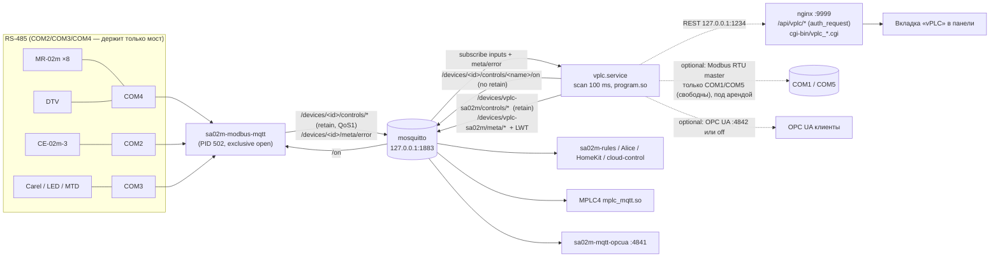

# vPLC на SA-02m — план интеграции со стеком SA-02m-web-build

Статус: проект (design), 2026-10-04; правки по живому снимку 1.135 от
21:54 MSK внесены **в этот экземпляр** (`SA-02m-web-build`). Зеркало лежит в
репозитории `vPLC` (`docs/SA02M_INTEGRATION_PLAN.md`); оба экземпляра должны
совпадать по содержанию — зеркало синхронизирует владелец репозитория `vPLC`
с этой версии. Машинные имена (пути, unit'ы, топики, порты, ключи
конфигурации) — на английском, пояснения — на русском.

Источники: `vPLC/vplc` (`README.md`, `docs/*.md`, `runtime/src/**`,
`runtime/packaging/**`, `compiler/compile.sh`, `deploy_to_device.sh`,
`tools/deploy_sa02m_fast.sh`, `vscode-extension/package.json`),
`SA-02m-web-build` (`docs/agent-rules/sa02m-domain.md`, `docs/MQTT_TOPICS.md`,
`docs/MPLC4_MQTT.md`, `docs/contracts/{rs485-roster,template-device,mqtt-set-endpoint,sh-model}.md`,
`opt/sa02m-modbus-mqtt/*`, `opt/sa02m-flasher/sa02m_flasher/{mplc_lease,config}.py`,
`etc/sa02m_flasher.conf`, `etc/systemd/**`, `etc/mosquitto/10listeners.conf`,
`etc/sa02m-web-service-ctl.sh`, `www/network_config/cgi-bin/services_ctrl.cgi`,
`www/network_config/static/js/app/services.js`, `scripts/lib.sh`, `install.sh`,
`etc/nginx/network_config.conf`, `etc/sudoers.d/sa02m-www`,
`opt/sa02m-cloud-agent/sa02m-cloud-agent.py`, `opt/sa02m-mqtt-opcua/sa02m-mqtt-opcua.py`,
`etc/sa02m-update-runner.sh`), библиотека драйверов `devices`
(`README.md`, `schema/device-descriptor.schema.json`, `devices/cyntron/*.json`,
`codegen/*.py`, `generated/**`), и живое устройство `192.168.1.135`
(read-only SSH, см. §1).

---

## 1. Состояние устройства 192.168.1.135 (факты, снято 2026-10-04 15:04 MSK, перепроверено 21:54 MSK)

SSH: ключ `private/.ssh/sa02m_sa02` в репозитории отсутствует (есть только
`sa02m_sa02.parked` и `.pub`), вход выполнен по паролю из
`tools/sa02m-device.env` через `sshpass` в WSL. Все команды — только чтение.
Повторный снимок 21:54 MSK (uptime 1 д 5 ч, `loadavg` 6.48): владельцы COM,
версия Python, состояние `vplc.service` (PID 1747, `cycle_count` 1052368,
`overrun_count` 2, программа `blink`), порты 1234/4840 у vplc и пустое дерево
`/devices/vplc-sa02m/#` — без изменений; `poll_errors` моста вырос с 49 до 118.

### 1.1 Платформа

| Параметр | Значение |
|---|---|
| hostname / модель | `SA-02m`, `SA02M_BOARD_MODEL="Cyntron A40i-2Eth"`, вариант `sa02m-1eth` |
| ОС / ядро | Armbian 26.5.1 noble (Ubuntu 24.04), `6.1.0-rc6-rt4 #4 SMP PREEMPT_RT`, `armv7l`, cmdline `threadirqs` |
| CPU | 4× ARMv7 rev 5 (Cortex-A7, `0xc07`), `nproc`=4 |
| RAM | 491 MiB всего, **206 MiB available**, 44 MiB free, swap 0 |
| Диск | `/dev/root` 7.0 G, занято 5.1 G (74 %), свободно 1.9 G; `/run` tmpfs 99 M |
| Нагрузка | `loadavg` 7.57 / 6.73 / 6.74 (на 4 ядра), `top`: 16 % us, **37.6 % sy**, 38.7 % idle; uptime 22 ч 25 мин |
| Веб-панель | `www/network_config/VERSION` = **1.0.7.1** (ветка репо `1.0.7.1`) |
| Инструменты на плате | `python3` 3.12.3 есть; **`gcc`/`cc`/`iec2c` отсутствуют**; бинарник `docker` есть, `docker.service` inactive (работает только `containerd`) |

Высокая загрузка — стендовая: `modbus_mqtt_bridge.py` 29 % CPU (14 устройств,
три COM в непрерывном round-robin), `sa02m-test-trigger.py` (hardpy) 12.5 %,
`sugov` 18.8 % в момент снимка. Это важно для бюджета §5.7: vPLC сосуществует
с уже загруженной системой.

### 1.2 Службы (`systemctl list-units --state=running`)

Запущены: `vplc`, `sa02m-modbus-mqtt`, `sa02m-telemetry`, `sa02m-flasher`,
`sa02m-rules`, `sa02m-cloud-agent`, `sa02m-cloud-frpc`, `sa02m-cloud-control`,
`sa02m-alice-client`, `sa02m-homekit`, `sa02m-devices-logger`, `sa02m-agent-api`,
`sa02m-userspace-watchdog`, `sa02m-failure-monitor`, `net-watchdog`, `mosquitto`,
`nginx`, `fcgiwrap`, `containerd`, стендовые `sa02m-stand-api` (gunicorn ×4),
`sa02m-test-trigger`. Таймер `sa02m-rs485-roster.timer` активен (тик 8 с).

| Unit | LoadState / ActiveState | enabled | Примечание |
|---|---|---|---|
| `vplc.service` | loaded / **active (running)** | enabled | PID 1747, старт 2026-10-03 16:40:19, `NRestarts=0`, `WatchdogUSec=0`, `Nice=0`, `CPUWeight` не задан, 6 потоков, `VmRSS` 5020 kB, `VmHWM` 7540 kB, CPU-время 86 мин за 22 ч (≈6 % одного ядра) |
| `mplc4.service` | loaded / active (**exited**) | enabled | oneshot-обёртка над `/etc/init.d/mplc4`; процесс `/opt/mplc4/./mplc` («Main», PID 2175, RSS 21.6 MB) слушает `0.0.0.0:30750`, `:30550`; `mplc_monitor` (PID 1830) — `:31550`, `:30501`; веб MasterSCADA — nginx `:8082` (не 4096). **COM-порты MPLC4 не держит** |
| `mplc.service` | masked | masked | — |
| `sa02m-modbus-mqtt.service` | loaded / active (running) | enabled | PID 502, RSS 19.5 MB, держит COM2/COM3/COM4 |
| `codesyscontrol.service` | loaded / inactive | disabled | `STACK_CODESYS=absent`; порты 4840/11740 CODESYS не занимает |
| `sa02m-mqtt-opcua.service` | loaded / inactive | disabled | `/etc/sa02m-mqtt-opcua.conf`: `"port": 4841` |
| `sa02m-serial-gateway.service` | loaded / inactive | disabled | — |
| `mosquitto.service` | active | disabled(!) | `127.0.0.1:1883` (anon), `0.0.0.0:1884` (auth) |
| `nodered` | not-found | — | `STACK_NODERED=absent` |

`/etc/sa02m_stacks.conf`: `STACK_CODESYS=absent`, `STACK_DOCKER=present`,
`STACK_KLOGIC=absent`, `STACK_MPLC=present`, `STACK_NODERED=absent`.

### 1.3 Сетевые порты (`ss -ltnp`)

| Порт | Владелец | Bind |
|---|---|---|
| 22 | sshd | 0.0.0.0 |
| 80, 9999 | nginx (панель) | 0.0.0.0 |
| 1883 | mosquitto | **127.0.0.1** |
| 1884 | mosquitto | 0.0.0.0 |
| **1234** | **vplc** (REST/WS/Web UI) | **0.0.0.0** |
| **4840** | **vplc** (OPC UA) | **0.0.0.0** |
| 8082 | nginx (MPLC4 web) | 0.0.0.0 |
| 8765 | gunicorn `sa02m-stand-api` | 127.0.0.1 |
| 30501, 31550 | `mplc_monitor` | 0.0.0.0 |
| 30550, 30750 | `mplc` Main | 0.0.0.0 |
| 21064 | python (стенд) | 192.168.1.135 |
| 502, 4841, 11740, 4096 | **никто** | — |

### 1.4 RS-485: кто держит COM

`/dev/COM1→ttyS0`, `COM2→ttyS3`, `COM3→ttyS4`, `COM4→ttyS5`, `COM5→ttyS7`
(`/etc/sa02m_serial_map.conf`, профиль `sa02m-1eth`; `RS-485-N ↔ COM(N+1)`).

| Порт | `fuser` | Скорость | Устройства из `/etc/sa02m-modbus-mqtt.yaml` |
|---|---|---|---|
| `/dev/COM1` | **свободен** | — | — |
| `/dev/COM2` | PID 502 `modbus_mqtt_bridge.py` | 115200 | `ce02m3-COM2-14` |
| `/dev/COM3` | PID 502 | 19200 | `carel-COM3-1` (crst), `carel-COM3-2` (uaria, `meta/error=r`), `mr02m-COM3-10` (6DO8DI), `led-COM3-13`, `mr02m-COM3-6` (6AI6AO), `mtdx62-mb-COM3-20` (template) |
| `/dev/COM4` | PID 502 | 115200 | `dtv-COM4-3`, `mr02m-COM4-10` (14DI), `-11` (16DO), `-12` (12AI, `ai_sensor_schema: 2`), `-13` (12AO), `-14` (16DO); все `fast_modbus: true` |
| `/dev/COM5` | **свободен** | — | — |
| TCP | — | — | `mp02-ahu-tcp-192_168_1_20-1` (template, `meta/error=r`) |

`/devices/sa02m-bridge/controls/devices_total 14`, `devices_online 12`,
`poll_errors 49` (118 к 21:54). Журнал моста: `port.COM4` цикл avg ≈ 95–108 ms (max до
1209 ms), `port.COM3` avg ≈ 270–290 ms (max до 986 ms), `port.COM2` avg ≈
113–126 ms; `carel-COM3-2` периодически «Short response: 0/77 bytes».

`/run/sa02m-rs485-roster.json`: `COM4` live, 6 «наших» online; `COM2` —
`CE-02m-3` online; `COM3` — `6AI6AO`@6 и `6DO8DI`@10 online, `third_party`
total 4 / online 3. Имена в MQTT (снимок 21:54): `/devices/<id>/meta/name` —
отображаемое имя из YAML (`МР-02м 14ДИ (COM4 addr=10)`, `МР-02м (COM3
addr=10)` без типа), машинная модель — контрол `module_type` **всегда
count-first** (`14DI`, `16DO`, `12AI`, `12AO`, `6AI6AO`, `6DO8DI`); те же
строки — поле `model` ростера. Значения контролов — числовые строки
(`/devices/mr02m-COM3-6/controls/ai_1 0.728`, `/devices/ce02m3-COM2-14/controls/current_c 0.264`,
`/devices/mr02m-COM4-10/controls/di_1 0`), мета — retained JSON в
`…/controls/<name>/meta` (`{"precision": 3, "readonly": true, "type": "voltage", "units": "V"}`),
у части контролов рядом лежат старые по-ключевые `…/meta/type`,
`…/meta/readonly`, `…/meta/precision`. У **online** устройств retained
`/devices/<id>/meta/error` нет вовсе — он появляется (= `r`) только у
offline (`carel-COM3-2`, `mp02-ahu-tcp-192_168_1_20-1` и сироты).
В `/run/sa02m-modbus-mqtt/` лежат per-device live-кеши,
`_roster.json`, а также `scan-lease.sock` и `scan-lease.log` (шов аренды
между флешером и мостом; его протокол в этом документе не разбирался —
«не проверено на 1.135»).

На брокере также висят **осиротевшие retained** деревья
`mp02-ahu-tcp-192_168_1_135-1` и `carel-tcp-192_168_1_199-1` (`meta/error=r`,
в YAML их нет) — vPLC-генератор (§3.4) обязан брать список устройств из YAML,
а не из `/devices/+/meta/name`.

### 1.5 Что уже стоит из vPLC

| Факт | Значение |
|---|---|
| Пакет | `vplc 1.0.1 armhf` (dpkg), `Installed-Size: 4725`, `Depends: libc6, libstdc++6, libmodbus5, libpaho-mqtt1.3, libsqlite3-0`; на плате также `libpaho-mqtt1.3 1.3.13`, `libmodbus5 3.1.10` |
| `/etc/vplc.conf` | `cycle_ms 100`, `rest_port 1234`, `autostart true`, `modbus_slave_enabled false` (`modbus_slave_port 1502`), `mqtt_enabled true` → `127.0.0.1:1883`, `mqtt_client_id "vplc-sa02m"`, **`opcua_enabled true`, `opcua_port 4840`**, `project_path ""` |
| `GET /api/status` | `{"state":"RUNNING","program":"blink","cycle_ms":100,"cycle_count":807024,"last_cycle_ms":0.12,"max_cycle_ms":260.32,"overrun_count":2,"var_count":6,"version":"1.0.1"}` |
| `GET /api/mqtt/status` | `{"connected":true,"broker":"127.0.0.1:1883","topics":0,"rx":0,"tx":0}` — **карта `mqtt_io` пуста**, ничего не публикуется: `mosquitto_sub -t '/devices/vplc-sa02m/#'` и `'/devices/vplc/#'` → пусто |
| `GET /api/modbus/status` | `{"slave":{"enabled":false,"listening":false,"port":502,...},"devices":[]}` |
| `/var/lib/vplc/` | `program.so` 8052 B (blink), `dump.bin` 145 B, `mbmaster.vplc` 20 KB, `mqtt_io.vplc` 24 KB (проекты лежат, но `project_path` не указывает ни на один) |
| Unit | `/usr/lib/systemd/system/vplc.service` из пакета: `After=network.target mosquitto.service`, `Wants=mosquitto.service`, `Restart=on-failure`, `TimeoutStopSec=15`, `AmbientCapabilities=CAP_NET_BIND_SERVICE`, `RuntimeDirectory/StateDirectory/LogsDirectory=vplc` |
| Журнал | за сутки две записи `[ScanCycle] Cycle overrun: 260.32 ms (limit 100 ms)` (13:03) и `101.39 ms` (14:03) — overrun'ы на программе «blink» с пустой картой I/O, т.е. это джиттер планировщика под нагрузкой стенда, а не вычисления |
| Сторожа | `RuntimeWatchdogSec=15s` (PID 1 кормит `/dev/watchdog`), `sa02m-userspace-watchdog` (`FAIL_THRESHOLD=60`, `CHECK_INTERVAL=10`, `REQUIRED_PROCS` по умолчанию `nginx sshd`), `sa02m-failure-monitor`, `net-watchdog`. vPLC ни в один из них не входит; `sd_notify` в коде vPLC **отсутствует** (поиск по `runtime/src`) |
| Облако | `frpc.toml`: `localPort = 80` и `localPort = 9999` — только панель; 1234/4840 из облака недостижимы |

Итог по §1: vPLC установлен и работает, но «вхолостую» (нет карты I/O, нет
публикации), занимает чужой по политике репозитория порт 4840, слушает REST на
всех интерфейсах и не включён ни в один контур управления/надзора SA-02m.

---

## 2. Целевая архитектура

### 2.1 Принцип

`sa02m-modbus-mqtt` — **единственный владелец RS-485 для наших модулей**
(MR-02m, DTV, CE-02m-3, Carel, LED, template). vPLC по умолчанию **не
открывает `/dev/COM*`**: входы читаются из retained-топиков
`/devices/<id>/controls/<name>`, выходы пишутся в `/devices/<id>/controls/<name>/on`
(без retain), как это делают `mqtt_set.cgi`, `sa02m-rules` и Алиса. Это
сохраняет инвариант аренды порта (`sa02m-domain.md ## Subsystems`,
`mplc_lease.py`): флешер останавливает только `MPLC_STOP_SERVICES`, vPLC
останавливать не надо.



### 2.2 Режим A — MQTT (по умолчанию, рекомендуемый)

- vPLC подписан на N входных топиков из карты `mqtt_io` и на
  `/devices/<id>/meta/error` для каждого участвующего устройства (§3.5).
- Выходы: при изменении переменной публикуется **`/devices/<id>/controls/<name>/on`**
  с `retain=0`. Сегодняшний `MqttAdapter::post_scan()` публикует в сам
  `topic` из карты с `retained = retain_outputs (true)` — для чужих устройств
  это **недопустимо**: retained `/on` переигрывается при рестарте моста и
  повторно щёлкает реальные реле (инвариант `mqtt-set-endpoint.md`), а запись
  в `/devices/mr02m-*/controls/do_1` (без `/on`) подменяет echo моста. Нужна
  правка адаптера: для `is_input=false` и `topic` не из своего дерева —
  публиковать `topic + "/on"`, `retain=0`, QoS 1 (мост слушает `/on`).
- Собственные переменные vPLC публикуются retained в
  `/devices/vplc-sa02m/controls/<var>` (+ `/meta/*`, §6).
- Задержка контура «вход → логика → выход» = период опроса моста по порту
  (COM4 ≈ 100 ms, COM3 ≈ 280 ms) + scan 100 ms + запись `/on` → следующий
  проход моста. Для DI на MR-02m с `fast_modbus: true` события приходят за
  ≈50–100 ms. Это **не** детерминированный контур; для задач быстрее ~0.5 с
  — режим B.

### 2.3 Режим B — прямой Modbus RTU master из vPLC

Допустим **только** при выполнении всех условий:

1. Порт не упомянут ни в одном `devices[].port` в `/etc/sa02m-modbus-mqtt.yaml`
   и не используется MPLC4/CODESYS/`sa02m-serial-gateway` (на 1.135 шлюз
   `inactive`). На 1.135 сегодня это **COM1 и COM5**.
2. vPLC открывает порт эксклюзивно (`TIOCEXCL`; в `modbus_master.cpp` сейчас
   `modbus_new_rtu(serial, baud, 'N', 8, 1)` без exclusive — добавить) и
   отражает занятость через `fuser` (флешер смотрит именно `fuser`,
   `mplc_lease.port_occupants`).
3. `vplc.service` добавлен в `MPLC_STOP_SERVICES` (`/etc/sa02m_flasher.conf`),
   чтобы скан/прошивка на этом порту останавливали vPLC и возвращали после
   (`port_lease()` → `stop_service`/`start_service`). Делает это `15-vplc.sh`
   только при наличии RTU-устройств в конфиге vPLC (§8).
4. На веб-вкладке «Службы» кнопка «Пуск» для `vplc` блокируется `flasher_busy`
   **только** в режиме B (см. §5.3).

Ограничения текущего `ModbusMaster`: только FC3 (`modbus_read_registers`) и
FC16 (`modbus_write_registers`), 500 ms таймаут, переменные `<dev>_IW<addr>` /
`<dev>_MW<addr>` типа `UINT`. Для MR-02m этого недостаточно: DO — coils
(FC1/FC5/FC15), DI — input registers (FC4), AI — holding `400+7*(n-1)` с
`+3`. Значит, прямой режим для наших модулей потребует расширения мастера
(FC1/2/4/5/15 + таблицы из `devices`), и пока он годится для сторонних
holding-only устройств. Это ещё один довод в пользу режима A как основного.

### 2.4 Правило выбора

| Критерий | Режим A (MQTT) | Режим B (RTU) |
|---|---|---|
| Модуль уже в YAML моста | **да, только A** | запрещено (двойной мастер на half-duplex) |
| Нужны Алиса / сценарии / облако по тем же точкам | A | A (мост остаётся источником) |
| Контур < 500 ms, детерминизм | — | B на свободном порту |
| Стороннее устройство без шаблона моста | A через `type: template` (`template-device.md`) | B, если holding-only |
| Порт занят MPLC4 | — | запрещено |

---

## 3. Драйверы `devices` → мост → vPLC

### 3.1 Что есть в репозитории `devices`

- `schema/device-descriptor.schema.json` (draft 2020-12): `id`, `vendor`,
  `model` (`^[A-Za-z0-9][A-Za-z0-9._+-]*$`), `protocol`
  (`modbus_rtu|modbus_tcp|spodes|fmb`), `type_id`, `line{baud,stopbits}`,
  `identify`, `io_caps{do,di,ao,ai}`, `channels[]` (`name`, `reg_type`
  `coil|discrete|input|holding`, `address`, `format` `u16|s16|u32|s32|float`,
  `word_order`, `scale`, `offset`, `units`, `mqtt_type`, `role`, `function`,
  `writable`, `readonly`, `title`, `title_en`), `blocks[]`, `enums[]`,
  `diagnostics[]`.
- 20 дескрипторов: `devices/cyntron/mr02m-*.json` (13 типов, `type_id` 1–12,
  15), `dtv.json`, `ce02m3.json`, `carel.json`, `led.json`, `mp02-ahu.json`,
  `mercury-spodes.json` (`channels: []`), `third-party/mtdx62-mb.json`. Все
  `verified: false`.
- `codegen/`: `validate.py`, `descriptors.py`, `decode.py`, `gen_python.py`
  → `generated/devices_tables.py` (`MR02M_MODULE_TYPES`, `MR02M_TYPE_NAMES`,
  `ALIASES`, `IO_CAPS`, `CHANNELS`), `gen_c.py` → `generated/cyntron_devices.h`,
  `gen_json.py` → `generated/devices.bundle.json`, `gen_st.py` →
  `generated/st/DEV_<MODEL>.st`, `build_all.py`.
- `iec/oscat_basic/*.st`, `iec/cyntron/masc.st` — библиотека ST.

Имена каналов в дескрипторах **совпадают с именами контролов моста**
(`do_1`, `di_1`, `di_1_count`, `ai_1`, `mcu_temp`, …) — это и есть связующее
звено: одно имя — в YAML моста, в MQTT-топике и в переменной vPLC.

### 3.2 Как мост использует дескрипторы (сделано в 1.0.7.1 / целевое состояние)

Сегодня таблицы моста живут в `opt/sa02m-modbus-mqtt/bridge_mr02m_map.py`
(`MR02M_MODULE_TYPES`, `MR02M_TYPE_NAMES`), копии — в
`opt/sa02m-alice/sa02m_alice/config/inventory.py`, `static/js/mqtt.js`
(`MR02M_TYPES`) и во флешере `module_profiles.py` (`MP02_TYPE_NAMES`,
`TYPE_IO_CAPS`); сверяются тестами (`opt/sa02m-alice/tests/test_inventory.py`,
`opt/sa02m-modbus-mqtt/tests/test_mr02m_name_alias.py`).

**Сделано в 1.0.7.1 (без сабмодуля и без cross-import):** `scripts/14-cyntron-devices.sh`
копирует `generated/devices_tables.py` **рядом с каждым пакетом, который его
читает** — `opt/sa02m-modbus-mqtt/devices_tables.py` и
`opt/sa02m-rs485-roster/devices_tables.py` (копии закоммичены, заголовок
«generated, do not edit»; правило репозитория: `opt/*` не импортируют друг
друга, общий код — только копией сгенерированного файла; скрипт только
копирует, codegen `build_all.py` запускается в репозитории `devices`).
На плату копия едет штатно: `05-mqtt.sh`/`update-www-only.sh` ставят её
перед модулями моста, `10-rs485-roster.sh` — rsync каталога, OTA — по
allow-list `opt/sa02m-*/`. Используется пока **только `ALIASES`**: мост
расширяет ею список «устаревших» написаний (`_legacy_name_tokens`: YAML-имя
`MR-02m AO6AI6` → имя по умолчанию), ростер нормализует `model` из
signature-fallback флешера (`AO6AI6` → `6AI6AO`). Канонические count-first
имена, которые мост публикует (`module_type`, `model` ростера, `meta/name` по
умолчанию), по-прежнему берутся из `MR02M_TYPE_NAMES` — таблица `devices`
их **не может** переименовать (тест с «враждебной» таблицей), а
несовпадение копии с таблицами моста/флешера валит `py-unit`.
Отсутствие копии — тождественное поведение.

Целевое (открытый вопрос 5): `generated/devices_tables.py` становится
**единственным домом** таблиц — `bridge_mr02m_map.py` берёт
`MR02M_MODULE_TYPES`/`MR02M_TYPE_NAMES` из копии, `inventory.py`, `mqtt.js`
и флешер сверяются с ней; контрол-имена, `mqtt_type`, `units`, `scale` для
публикации `/meta/*` берутся из `CHANNELS[model]`. Семантику AI (scale по
`ai_sensor_type`) мост продолжает считать сам — дескриптор это фиксирует
(`enums.ai_sensor_type`), а не переопределяет. Снимок 21:54 подтверждает
посылку: `/devices/mr02m-COM3-6/controls/ai_1 = 0.728` с мета
`type voltage, units V` — физическая величина, не сырой код.

### 3.3 Что дескриптор даёт vPLC

Для одного устройства из YAML (`id`, `type`, `module_type`, включённые
`channels`) и его дескриптора получаем автоматически:

1. **Карту `mqtt_io`** (топик → переменная, направление, scale/offset, тип):

   | Канал (role) | Топик | `is_input` | Тип IEC | scale/offset |
   |---|---|---|---|---|
   | `do_N` (writable coil) | `/devices/<id>/controls/do_N` (чтение echo) и `…/on` (запись) | обе: `do_N_fb` вход, `do_N` выход | BOOL | 1 / 0 |
   | `di_N` | `/devices/<id>/controls/di_N` | вход | BOOL | 1 / 0 |
   | `di_N_count` | `…/di_N_count` | вход | UDINT | 1 / 0 |
   | `ai_N` | `…/ai_N` | вход | REAL | **1 / 0** — мост публикует уже физическую величину (°C, V, mA) |
   | `ao_N` | `…/ao_N` + `…/on` | вход (echo) + выход | REAL в вольтах | мост публикует сырое `0..1000` → вход `scale 0.01`; выход: `round(V/0.01)` (нужен `write_scale`, см. ниже) |
   | `mcu_temp`, `mcu_vdd`, … (role `diag`) | `…/<name>` | вход | REAL | 1 / 0 |
   | CE `power_total`, `voltage_a`, … | `…/<name>` | вход | REAL | 1 / 0 |
   | `meta/error` | `/devices/<id>/meta/error` | вход | BOOL `<DEV>_ok` | **нет retained-сообщения → TRUE** (у online-устройств топика нет вовсе — факт 1.135, §1.4), `"r" → FALSE`, `"" (очистка) → TRUE` |

   Правило имени переменной: `<DEV>_<control>`, где `<DEV>` — `id` с заменой
   `-`→`_` (`mr02m_COM4_11_do_1`, `ce02m3_COM2_14_power_total`). Имена
   детерминированы и переживают перегенерацию.

   Что надо добавить в `MqttIoMap`/`config.hpp`: `write_topic` (по умолчанию
   `topic + "/on"` для чужих устройств), `write_scale`/`write_offset`
   (обратное преобразование для AO), `retain` (0 для `/on`), `quality_var`
   (имя BOOL, которую адаптер ставит по `meta/error` и по stale-таймауту),
   `plc_type` (чтобы `set_from_string` не терял тип). Сейчас `pre_scan()`
   делает `std::stod` → `std::to_string` → `set_from_string`, что для BOOL
   даёт строку `"1.000000"` — проверить `set_from_string` на BOOL из такой
   строки (риск: `"1.000000"` ≠ `"1"`); для `mqtt_type=text`
   (`reset_reason`, `module_type`) проход «as-is» корректен.

2. **ST `FUNCTION_BLOCK DEV_<MODEL>`** с типизированными входами/выходами.
   Существующий `gen_st.py` генерирует `DEV_6DO8DI` с `VAR_INPUT W_1…W_65510 :
   WORD` (сырые регистры) и типизированными `VAR_OUTPUT do_1 : BOOL …` — это
   форма для режима B (RTU: регистры → физические величины). Для режима A
   нужен второй профиль генератора `--mode mqtt`:

   ```iecst
   FUNCTION_BLOCK DEV_16DO_MQTT
   VAR_INPUT
       ok        : BOOL;            (* /devices/<id>/meta/error = "" *)
       do_1_fb   : BOOL;  (* … *)   (* echo мостa, retained control *)
   END_VAR
   VAR_IN_OUT
       do_1 : BOOL; (* … do_16 *)   (* команда → <topic>/on *)
   END_VAR
   VAR_OUTPUT
       mismatch  : BOOL;            (* do_N <> do_N_fb дольше T_fb *)
   END_VAR
   ```

   Экземпляр FB связывается с глобальными переменными `<DEV>_*` из карты
   `mqtt_io` сгенерированным фрагментом `VAR_GLOBAL`/`CONFIGURATION` (MATIEC
   поддерживает `VAR_GLOBAL` в `CONFIGURATION`; `compile.sh` сегодня
   оборачивает только `PROGRAM`, нужен шаг «подключить `devices/iec` и
   `generated/st` через `-I`»). OSCAT (`iec/oscat_basic`) подключается тем же
   путём; `LICENSE-OSCAT.md` — в пакет `vplc-ieclib`.

### 3.4 Генератор `roster → vplc mqtt_io`

Место: репозиторий `vPLC`, `tools/sa02m_mqtt_io_gen.py` (stdlib-only Python
3.6+, как `codegen/validate.py`), ставится на плату `15-vplc.sh` в
`/opt/sa02m-vplc/sa02m_mqtt_io_gen.py`. Запуск вручную, из CGI вкладки «vPLC»
(кнопка «Собрать карту I/O») и `ExecStartPre=` vPLC в режиме `--if-stale`.

Входы:
- `/etc/sa02m-modbus-mqtt.yaml` — список устройств (`id`, `type`,
  `module_type`, `template`, `channels.*[].enabled`, `sensors_present`,
  `channels_enabled`, `phases`, `publish_per_phase_energy`); **именно YAML**,
  а не `/devices/+/meta/name` (на брокере лежат сироты, §1.4). Требует
  `python3-yaml` — на плате есть (мост его импортирует).
- `/run/sa02m-rs485-roster.json` — только для `online`-подсказки и
  предупреждения «устройство в YAML, но не на линии»; отсутствие файла — не
  ошибка (`rs485-roster.md`: отсутствие = «нет данных»).
- `/opt/sa02m-vplc/devices.bundle.json` (копия `generated/devices.bundle.json`)
  — каналы по `type`/`module_type`/`template`.

Выходы (атомарно `tmp → rename`):
- `/etc/vplc.d/mqtt_io.generated.json` — фрагмент `{"mqtt_io":[…]}`.
  Нужна поддержка в `Config::load`: читать `/etc/vplc.d/*.json` после
  `/etc/vplc.conf` (merge по `topic+var_name`, generated < hand-written).
- `/var/lib/vplc/generated/sa02m_io.st` — `VAR_GLOBAL` объявления и
  экземпляры `DEV_<MODEL>_MQTT`, и `/var/lib/vplc/generated/sa02m_io.json`
  (та же таблица для IDE/VS Code: расширение подтягивает её с устройства и
  вставляет в `.vplc` `variables`/`mqtt_io_map`).
- Альтернатива для проектов `.vplc`: `--write-vplc <file>` пишет в таблицы
  `variables` и `mqtt_io_map` (SQLite через `sqlite3` из stdlib).

Правила: только `enabled: true` каналы; для `mr02m` набор каналов по
`IO_CAPS[model]` и `module_type` → `MR02M_TYPE_NAMES`; AI-каналы с
`sensor_type: 0` («Выключен») пропускаются (на 1.135 все 12 AI у
`mr02m-COM4-12` именно такие: `type value`, `units ""`, `0.0`); `type: template` — по
`CHANNELS[template]` **в пределах v1 моста** (`template-device.md` §3–4:
только `coil|discrete|input|holding`, форматы `u16|s16|u32|s32|float`,
writeback только 16-битный — записываемый `holding` с 32-битным форматом мост
не пишет, значит генератор заводит для него только вход; каналы с
битовыми адресами, `bcd`/`string`/`u64`, `byte_order`, `consists_of`,
`condition` мост пропускает — их нет и в карте); `type: spodes`, `carel`, `led` — по дескрипторам
(`carel.json`, `led.json`), `mercury-spodes.json` без адресов, но имена
контролов известны — для vPLC этого достаточно. Устройства с `transport: tcp`
включаются (MQTT одинаков). Генератор идемпотентен и печатает diff.

### 3.5 Семантика качества (quality)

Источники: device-level `/devices/<id>/meta/error` (`"r"` после серии
неудачных опросов, `""` online; graceful offline и LWT моста →
`/devices/sa02m-bridge/meta/error = "r"`, `modbus_mqtt_bridge.py:428`),
per-control `/devices/<id>/controls/<name>/meta/error` (`"r"`/`"w"`),
`/devices/sa02m-bridge/controls/connection` (`1`/`0`).

Поведение vPLC (новая логика `MqttAdapter`, настраивается в `mqtt_io` и
глобально):

| Событие | Входные переменные | Переменная качества |
|---|---|---|
| `meta/error = "r"` устройства | **удержание** последнего значения (`on_invalid: hold`, по умолчанию) или подстановка `safe_value` (`on_invalid: safe`) | `<DEV>_ok := FALSE` |
| `meta/error = ""` или **топика нет** (начальное состояние для online-устройства: мост не публикует пустой `meta/error`, только снимает его — §1.4) | обновление идёт с первого retained/нового сообщения | `<DEV>_ok := TRUE` (значение по умолчанию до первого `"r"`) |
| нет ни одного сообщения по топику дольше `stale_ms` | hold | `<DEV>_<ctrl>_q := FALSE`. По умолчанию `stale_ms` = 2 × `max_unchanged_interval` моста + `poll_s` (мост публикует изменение сразу и **повторяет неизменённое значение раз в `max_unchanged_interval`**, по умолчанию 60 с — `bridge_mqtt.py`, ключ YAML `max_unchanged_interval`; в снимке 21:54 `ai_4 0.0`/`ao_1 0` пришли повторно без изменения), т.е. ≈ 125 с при дефолтах; минимум 5000 ms. Таймер нужен для каждого контрола, а не только там, где нет `meta/error` |
| `sa02m-bridge/controls/connection = 0` или LWT `"r"` | hold для всех устройств моста | `BRIDGE_ok := FALSE` |
| vPLC потерял брокер (`connect_lost_cb`) | hold | `MQTT_ok := FALSE`; все `<DEV>_ok := FALSE` |

Программа ST обязана проверять `ok`/`_q` перед использованием входа — это
единственный честный путь (мост хранит last-good в retained, по значению
offline не отличить). Выходы при `ok = FALSE`: публикация `/on` **не
подавляется** (мост сам ставит `meta/error="w"` и ничего не пишет на шину),
но FB `DEV_*_MQTT` поднимает `mismatch`, если echo не совпал с командой дольше
`T_fb` (по умолчанию 2 × `poll_s` + 1 с).

Для собственного дерева vPLC: `/devices/vplc-sa02m/meta/error` через **LWT**
(`MQTTAsync_willOptions`, retain) = `"r"` при падении; `""` после подключения;
`/devices/vplc-sa02m/controls/connection` = `1`/`0`; при `STOPPED` (не
RUNNING) — `/devices/vplc-sa02m/controls/runtime_state` = `STOPPED`, а
`meta/error` остаётся `""` (процесс жив). Это даёт `sa02m-rules`/облаку тот же
монитор `/devices/+/meta/error`, что и для модулей.

---

## 4. Программирование и заливка

### 4.1 Основной путь: PC → Docker MATIEC → `.so` → устройство

Как сейчас: `compile.sh` (`iec2c` → `POUS.c` + `gen_wrapper.py` →
`plc_wrapper.c` → `arm-linux-gnueabihf-gcc -shared -fPIC -O2 -march=armv7-a
-mfpu=neon-vfpv4 -mfloat-abi=hard`), затем **`POST /api/program/upload`**
(binary body; рантайм делает `stop → unload → tmp → rename → dlopen → init →
restore dump`) либо `scp` в `/var/lib/vplc/program.so` + `POST /api/program/reload`.
VS Code: команды `vplc.compileAndDeploy` (`Ctrl+Shift+D`), настройки
`vplc.target.host` (default в `package.json` — `192.168.1.136`, для стенда с
модулями нужен `.135`, см. `docs/SA02M_DEPLOY.md`), `vplc.target.restPort`,
`vplc.deploy.remoteSoPath`.

Что изменить: расширение должно слать `Authorization: Bearer <api_token>`
(поддержка в REST есть — `rest_server.cpp:199`), а при `rest_bind=127.0.0.1`
(§7) — ходить через веб-прокси панели (`https?://<ip>:9999/api/vplc/...` с
cookie `session_token` + `X-SA02M-CSRF`) или через SSH-туннель
(`ssh -L 1234:127.0.0.1:1234`). Рекомендация: добавить в расширение режим
`vplc.target.transport: "direct" | "ssh-tunnel" | "panel"`.

### 4.2 Альтернатива: загрузка через веб-вкладку «vPLC»

Новая вкладка `tab-vplc` в `www/network_config/index.html` (как `tab-mqtt`,
`tab-flasher`), бандл `static/js/vplc.js`, CGI:

| Endpoint | Метод | Назначение |
|---|---|---|
| `GET /api/vplc/api/status`, `/api/vplc/api/variables`, `/api/vplc/api/logs`, `/api/vplc/ws/variables` | GET / WS | nginx `location /api/vplc/ { auth_request /_auth_check; rewrite ^/api/vplc(/.*)$ $1 break; proxy_pass http://127.0.0.1:1234; proxy_http_version 1.1; proxy_set_header Upgrade $http_upgrade; proxy_set_header Connection $connection_upgrade; }` — чтение без токена (vPLC требует Bearer только на мутациях) |
| `cgi-bin/vplc_ctl.cgi` | POST `{action: start\|stop\|restart\|reload\|dump_save\|dump_restore\|gen_io}` | auth → CSRF → `sudo -n /usr/local/sbin/sa02m-vplc-ctl.sh <action>`; хелпер читает `api_token` из `/etc/vplc.conf` (root-only) и вызывает `curl -s -m 10 -H 'Authorization: Bearer …' -X POST http://127.0.0.1:1234/api/<…>`; `gen_io` запускает генератор §3.4 |
| `cgi-bin/vplc_program.cgi` | POST multipart `.so` (или `.vplc`) | auth → CSRF → приём с кэпом 4 MiB (`client_max_body_size 8m` в отдельном `location =`) → проверка в Python: ELF32 `e_machine=0x28` (ARM), `EF_ARM_ABI_FLOAT_HARD`, динамические символы `plc_init/plc_run/plc_variables/plc_variable_count/plc_program_name` (парсер `.dynsym` на stdlib, без `readelf`) → `sudo -n sa02m-vplc-ctl.sh upload <staged path>` → `POST /api/program/upload --data-binary` → `{pending}` + `?result=1`, как `mplc_project_deploy.cgi` |
| `cgi-bin/vplc_config.cgi` | GET / POST | чтение `GET /api/config` (секреты маскированы) и запись разрешённых ключей (`cycle_ms`, `autostart`, `log_level`, `opcua_enabled`, `opcua_port`) через `POST /api/config` → при `restart_required: true` — предложение рестарта |

Паттерны — из `mqtt_set.cgi` (allow-list, `timeout`, аудит в
`/var/log/sa02m_install.log`, HTTP 200 + `ok:false`), `services_ctrl.cgi`
(async + `/var/run/sa02m-svcctl/<id>.json`), nginx-блок `/api/flasher/`
(`auth_request`, strip служебных заголовков). Все строки UI на русском +
`DICT` в `i18n.js`; `&r=` cache-bust на затронутые ассеты.

### 4.3 Компиляция на устройстве — оценка

На плате нет `gcc`/`iec2c`. Чтобы собрать `.so` на месте, нужно поставить
`gcc`, `libc6-dev`, `binutils` (≈ 60–90 MB), собрать/поставить `iec2c`
(MATIEC, ≈ 10 MB + `/opt/ieclib`), скопировать `compiler/stdlib` и
`gen_wrapper.py`. Диск позволяет (1.9 G свободно). RAM: `iec2c` на проект в
сотни строк ~20–40 MB, `gcc -O2` одного `POUS.c` 50–150 MB пик; при 206 MB
available без swap и load ≈ 7 это **работает, но с риском OOM** при
одновременной сборке и всплеске моста/стенд-API, и время сборки на A7 1.2 GHz
— 10–40 с на небольшом проекте, минуты на OSCAT.

Рекомендация: **не делать компиляцию на устройстве стандартным путём**.
Канон — Docker `vplc-compiler` на PC (или CI); на плату едут только `.so`
(+ `.vplc` для карты I/O). Опционально — пакет `vplc-toolchain` для dev-стендов
с `nice -n 15`, `MemoryMax=160M` в transient unit (`systemd-run`), только по
явному запросу оператора; в заводской образ не входит.

### 4.4 Версионирование, откат, атомарность, dump

- Хранить программы в `/var/lib/vplc/programs/<name>-<sha256[:12]>.so`;
  `program_path` → симлинк `/var/lib/vplc/program.so`, замена симлинка
  атомарным `rename` (сегодня `api_upload_program` пишет `program.so.uploading`
  → `rename` поверх файла — атомарно для файла, но без истории). Хранить
  последние 5; `POST /api/program/rollback` переключает симлинк на предыдущую
  и делает `reload`. Метаданные — `/var/lib/vplc/programs/index.json`
  (`name`, `sha`, `uploaded_at`, `by: web|rest|scp`, `vplc_version`).
- `plc_program_name` (`"MyProject v1.0"`) обязателен и показывается во
  вкладке и в heartbeat (§6).
- Dump: `DumpManager::save` вызывается на shutdown только при `RUNNING`, и
  при `load_program` восстанавливается только при совпадении имени
  программы — это правильно; добавить периодический `dump_save` (например
  раз в 60 с, атомарно `dump.bin.tmp → rename`) для переживания жёсткого
  ресета (`RuntimeWatchdogSec=15s` реально перезагружает плату). Для RETAIN
  переменных — пометка в `variables.comment` или отдельная таблица
  `retain` в `.vplc`, чтобы не дампить всё.
- `.vplc` проект на устройстве (`project_path`) — источник `mqtt_io_map` и
  `modbus_devices`; загружать его тем же `vplc_program.cgi` (тип по
  расширению) в `/var/lib/vplc/project.vplc` и ставить `project_path`.
- Внимание: `tools/deploy_sa02m_fast.sh` делает `dpkg --purge --force-all vplc`
  и **перезаписывает `/etc/vplc.conf`** — это инструмент разработчика, не путь
  обновления на поле (§5.9).

---

## 5. Запуск/остановка vPLC и влияние на другие процессы

### 5.1 systemd unit и drop-in

Пакетный `/usr/lib/systemd/system/vplc.service` не трогаем; `15-vplc.sh`
ставит drop-in `/etc/systemd/system/vplc.service.d/sa02m.conf`:

```ini
[Unit]
# Мост — источник входов; стартуем после него, но не падаем без него.
After=mosquitto.service sa02m-modbus-mqtt.service
Wants=mosquitto.service
# Не Conflicts= с mplc4/codesyscontrol: порты разведены (§5.5), шина RS-485 vPLC не нужна.

[Service]
Restart=always
RestartSec=3
# Не RT: PREEMPT_RT ядро + SCHED_FIFO для прикладного PLC рядом с мостом на одном ядре даст
# приоритетную инверсию по MQTT-сокету. Умеренный вес CPU и nice ниже Python-служб.
Nice=-2
CPUWeight=200
IOWeight=100
MemoryMax=96M
MemoryHigh=64M
TasksMax=64
OOMScoreAdjust=-300
# Включать ТОЛЬКО после добавления sd_notify в vplc (§5.8); до этого строка закомментирована.
# Type=notify
# WatchdogSec=30s
ExecStartPre=-/usr/bin/python3 /opt/sa02m-vplc/sa02m_mqtt_io_gen.py --if-stale --quiet
```

`AmbientCapabilities=CAP_NET_BIND_SERVICE` из пакета оставляем (vPLC и так
root; при переводе на `User=vplc` понадобится `dialout` для режима B и доступ к
`/var/lib/vplc`).

### 5.2 Вкладка «Службы» и `sa02m-web-service-ctl.sh`

- `SERVICE_DEFS` += `vplc|vPLC|vplc.service`; `service_present` для `vplc`:
  `[ -x /usr/bin/vplc ] || dpkg -s vplc`. Не `svc_is_installable` (ставится
  установщиком/OTA, как `mqtt-bridge`) — кнопки «Пуск/Стоп», без
  «Установить/Удалить».
- `services.js`: `SVC_CTL_CATALOG` += `{ id: 'vplc', label: 'vPLC' }`,
  `svcCtlDisplayLabel` → `'vPLC'`; `DICT['vPLC'] = 'vPLC'`.
- `status.cgi?part=services`: `_dash_svc_add vplc "vPLC" …` на дашборд,
  `fast_service_state vplc.service`.
- `cmd_stop vplc`: перед `systemctl stop` — `curl -m 5 -X POST
  http://127.0.0.1:1234/api/stop` (чистый STOPPED → dump), затем stop +
  disable + mask (стандартная семантика скрипта).

### 5.3 `flasher_busy`

`cmd_start` сегодня гейтит `mplc4|mqtt-bridge`. Для `vplc` — **условно**:
гейтить, только если vPLC в режиме B. Признак — файл
`/etc/vplc.d/rtu-ports` (пишет `15-vplc.sh`/генератор при наличии
`modbus_devices[].mode == "rtu"` в `/etc/vplc.conf` или `.vplc`; содержит
список `/dev/COMn`). Тот же файл управляет строкой `MPLC_STOP_SERVICES`:
`15-vplc.sh` добавляет `vplc.service` в `/etc/sa02m_flasher.conf`, когда файл
непустой, и убирает — когда пуст (идемпотентно, через `sed` по ключу, с
`systemctl try-restart sa02m-flasher`). В режиме A флешер vPLC не трогает —
MQTT-подписки живут, при остановке моста входы получают `BRIDGE_ok=FALSE`
(§3.5), выходы `/on` мост применит после восстановления (без retain —
потерянные за время паузы команды **не** доедут; программа должна
перепубликовать по `ok` фронту, FB `DEV_*_MQTT` делает это сам при
`ok: FALSE→TRUE`).

### 5.4 Поведение выходов при stop/crash

| Ситуация | Что происходит с DO/AO на MR-02m | Кто выставляет безопасное состояние |
|---|---|---|
| `POST /api/stop` / `systemctl stop vplc` | мост продолжает опрашивать, выходы **замирают** в последнем состоянии | политика `outputs_on_stop` в `vplc.conf`: `hold` (по умолчанию, как у MPLC4 при остановке) или `safe` — vPLC перед остановкой скана публикует `safe_value` в каждый выходной `/on` (без retain) и ждёт echo ≤ 2 с |
| crash vPLC (SIGSEGV в `.so`) | то же — замирают | LWT ставит `/devices/vplc-sa02m/meta/error="r"`; `sa02m-rules` может иметь правило «если vplc offline → выключить критичные DO» (`/on` из движка). Это **единственный** путь к безопасному состоянию при краше, т.к. vPLC уже мёртв |
| перезагрузка платы (watchdog 15 s) | модули остаются с последним состоянием до старта моста | мост при старте **не** переигрывает `/on` (не retain); состояние DO = то, что в регистрах модуля |
| сторожевой таймер модуля MR-02m | **не проверено на 1.135**: в `MQTT_TOPICS.md`/дескрипторах нет регистра «таймаут связи → safe DO»; в `MR-02m` репо нужно проверить `MODBUS_VARIABLES` на наличие такого holding | если есть — задать его флешером (окно настроек) на 5–10 с; тогда замирание моста/vPLC ведёт к safe DO аппаратно |

Retained `/on` — **запрещено** (повторный щелчок реле при рестарте моста,
`mqtt-set-endpoint.md`). vPLC публикует `/on` с `retain=0` всегда.

### 5.5 Конфликты портов

| Порт | Сейчас | Решение |
|---|---|---|
| 502 (Modbus TCP slave) | свободен; vPLC slave выключен, в conf `1502` | оставить `modbus_slave_enabled=false` по умолчанию; при включении — **1502** (502 — для MPLC4/CODESYS slave, если их включат, и дефолт `tcp_port` у `sa02m-serial-gateway`, `serial_gateway.py:558`) |
| 4840 (OPC UA) | **vPLC занимает**, CODESYS absent | политика репозитория: 4840 — CODESYS (`docs/contracts/kernel-conditional-services.md`), 4841 — `sa02m-mqtt-opcua`. vPLC → **`opcua_port: 4842`** или `opcua_enabled: false` по умолчанию (на 1.135 OPC UA vPLC сейчас никто не читает — «не проверено», клиентов на 4840 в `ss` нет). Миграция в `15-vplc.sh`: если `opcua_port == 4840` → 4842 (как миграция 4840→4841 в `install.sh`) |
| 1234 (REST) | 0.0.0.0 | `rest_bind: "127.0.0.1"` (§7) |
| 1883 | mosquitto loopback | vPLC — локальный клиент, `client_id` **`vplc-sa02m`** стабилен (смена осиротит retained-дерево, как у `bridge_device_id`) |
| 8082/30xxx/31xxx | MPLC4 | не пересекаются |

### 5.6 Взаимодействие с MPLC4 / CODESYS

- Никаких `Conflicts=`: MPLC4 сейчас не держит COM, CODESYS не установлен.
  Если оператор включит в MPLC4 опрос Modbus RTU на COM, занятом мостом, —
  это существующая проблема `MPLC4_MQTT.md ## Координация`, vPLC её не меняет.
- Если CODESYS будет установлен (`cmd_install codesys` стартует его и
  проверяет `port_listening 11740`/4840) — vPLC на 4840 вызовет `EADDRINUSE`
  у CODESYS. Отсюда обязательность переноса на 4842 **до** появления CODESYS в
  поле.
- RT-ядро (`PREEMPT_RT`) и профиль CPU (`sa02m-cpu-profile.sh`, SMP-only) —
  vPLC не требует RT; на RT-ядре не использовать `SCHED_FIFO` для скана (нет
  `sched_setscheduler` в коде сейчас — хорошо, так и оставить).

### 5.7 Бюджет CPU/RAM при MPLC4 + vPLC + мост

| Процесс | RSS (факт 1.135) | CPU (факт) | Оценка с картой I/O ~300 точек, scan 100 ms |
|---|---|---|---|
| `modbus_mqtt_bridge.py` | 19.5 MB | 12–29 % | без изменений (vPLC добавляет ему только `/on`-записи — единицы в секунду) |
| `mplc` Main + `mplc_monitor` | 21.6 MB + ~10 MB | ~6 % | без изменений |
| `vplc` (blink, 6 vars, I/O пусто) | **5.0 MB** (HWM 7.5) | ≈ 6 % одного ядра | +2–4 MB на 300 подписок/кеш строк; `post_scan` делает `snapshot()` всех переменных каждый скан — при 300 переменных ≈ 0.1–0.3 ms на A7; WS-пуш только при подключённых клиентах (уже так). Ожидаемо ≤ 10 % одного ядра |
| mosquitto | ~5 MB | ~1–2 % | +300 retained подписок — пренебрежимо |
| Python-службы SA-02m (alice×2, homekit, flasher, rules, cloud, telemetry, logger, agent-api) | ≈ 170 MB суммарно | 5–10 % | без изменений |
| Стенд (`sa02m-stand-api` gunicorn ×5 ≈ 110 MB, `test-trigger` 12 %) | стендовые | — | на боевой плате отсутствуют → +~110 MB запаса |

Вывод: `MemoryMax=96M` для vPLC — с 10-кратным запасом; `206 MiB available` на
стенде достаточно, при условии что компиляция на устройстве не включена (§4.3).
Overrun'ы (260 ms) на пустой программе показывают, что при `cycle_ms: 100`
стоит считать «мягкий» дедлайн нормой и выводить `overrun_count` в heartbeat.

### 5.8 Watchdog

- `sd_notify` в vPLC **нет** → `WatchdogSec=` ставить нельзя (unit упадёт по
  таймауту). Добавить в `main.cpp` минимальную реализацию через
  `NOTIFY_SOCKET` (как `sd_notify()` в `modbus_mqtt_bridge.py:110`, без
  libsystemd): `READY=1` после `rest_.init`, `WATCHDOG=1` из главного цикла
  (200 ms) **только если** поток скана живой (`scan_.state()!=ERROR` и
  последний `cycle_count` растёт или состояние `STOPPED` намеренно) — тогда
  зависший `plc_run()` приведёт к перезапуску сервиса, а `Restart=always` +
  `autostart: true` + dump вернут программу. После этого — `Type=notify`,
  `WatchdogSec=30s` в drop-in.
- `sa02m-userspace-watchdog`: vPLC **не** добавлять в `REQUIRED_PROCS`
  (перезагрузка платы из-за прикладного PLC недопустима); можно в
  `WATCHED_PROCS` (только логирование).
- `sa02m-failure-monitor` (SSH/service monitor) — состав его проверок не
  читался; «не проверено на 1.135». Добавлять vPLC туда не предлагается.

### 5.9 OTA (`sa02m-update`) и обновление vPLC

- vPLC — `.deb` вне манифеста `offline-update-deploy-map.json`
  (`prefix_rules` покрывают `www/`, `opt/sa02m-*`, `usr/local/*`,
  `etc/systemd/system/sa02m-*`). Вариант: класть
  `vplc_<ver>_armhf.deb` на устройстве в `/opt/vendor-installers/vplc/`
  (каталог, который `sa02m-web-service-ctl.sh` уже бережёт при uninstall
  CODESYS/MPLC4; в репозитории источник payload — `private/` или отдельный
  артефакт CI, решить в открытом вопросе 4) и `15-vplc.sh` делает `dpkg -i`
  при `dpkg --compare-versions` «новее»; drop-in, генератор, CGI, nginx-блок
  едут обычным OTA-путём.
- Preserve-лист раннера (`etc/sa02m-update-runner.sh`, строки ~67–95):
  добавить `/etc/vplc.conf`, `/etc/vplc.d/`, `/var/lib/vplc/`. `dpkg -i`
  обновления пакета `/var/lib/vplc` не трогает (пакет создаёт каталог в
  `postinst`, файлы не его); `/etc/vplc.conf` — не conffile, `postinst`
  копирует `.default` только если файла нет — поведение корректное,
  зафиксировать в `prerm`: не удалять `/var/lib/vplc` при `remove`, только при
  `purge` (проверить текущий `prerm` — не читался).
- `dpkg -i` рестартует unit? `postinst` делает только `daemon-reload` +
  `enable`; рестарт делает `15-vplc.sh` через `sa02m_svc_apply vplc app on`
  (сохраняет операторское «выключено» — семантика `sa02m_svc_capture`/
  `sa02m_svc_apply` из `scripts/lib.sh` и режима `--refresh` в `install.sh`).

---

## 6. Взаимодействие с MPLC4 / CODESYS / Node-RED / Алисой / облаком

### 6.1 vPLC как MQTT-устройство `vplc-sa02m`

Публиковать (retained, QoS 1), по образцу моста:

```
/devices/vplc-sa02m/meta/name                 "vPLC (SA-02m)"
/devices/vplc-sa02m/meta/driver               "vplc"
/devices/vplc-sa02m/meta/error                ""   (LWT → "r")
/devices/vplc-sa02m/meta                      {"driver":"vplc","title":{"ru":"vPLC","en":"vPLC"}}
/devices/vplc-sa02m/controls/connection       "1"|"0"   type=switch
/devices/vplc-sa02m/controls/runtime_state    "RUNNING"|"STOPPED"|"IDLE"|"ERROR"  type=text
/devices/vplc-sa02m/controls/program          "<plc_program_name>"  type=text
/devices/vplc-sa02m/controls/cycle_ms         type=value
/devices/vplc-sa02m/controls/overrun_count    type=value
/devices/vplc-sa02m/controls/<var>            значение переменной с direction output|memory (по карте или все — ключ publish_all_outputs)
/devices/vplc-sa02m/controls/<var>/meta/type  BOOL→switch, REAL/INT→value, STRING→text
/devices/vplc-sa02m/controls/<var>/meta/readonly  "0" для переменных, принимающих /on, иначе "1"
/devices/vplc-sa02m/controls/<var>/on         ← запись (уже реализовано: on_message → set_from_string)
```

Сейчас `/on` принимается для **любой** переменной, включая входы — ограничить
переменными с `direction in {memory, inout}` или явным флагом `writable` в
`variables.comment`/карте; иначе внешний клиент перезапишет вход, который на
следующем скане всё равно перетрётся из MQTT (гонка, не ошибка безопасности,
но мусор в логике).

### 6.2 `sa02m-rules`, Алиса, HomeKit

Инвентарь Алисы (`inventory.py: build_mqtt_inventory`) строится из YAML моста,
ростера и контроллера (`_controller_entry`), а не из брокера. Чтобы
переменные vPLC появились в пикере привязок — добавить `_vplc_entries()`:
читает `/run/vplc/controls.json` (vPLC пишет его при загрузке программы в
`RuntimeDirectory=vplc`: `[{name,type,dir,writable,title}]`), формирует каналы
`/devices/vplc-sa02m/controls/<var>` с `rw` по `writable`. `sa02m-rules`
подписан на `/devices/+/controls/+` — переменные vPLC видит сразу; команда в
vPLC — `/devices/vplc-sa02m/controls/<var>/on`. Тест
`opt/sa02m-alice/tests/test_inventory.py` — расширить фикстурой с
`controls.json`.

### 6.3 MPLC4, Node-RED, OPC UA

- MPLC4 (`mplc_mqtt.so`) читает/пишет те же топики без конфликта портов.
- Node-RED — отсутствует на 1.135; при установке подписывается на `1883`.
- `sa02m-mqtt-opcua` (4841, выключен на 1.135) экспортирует
  `/devices/+/controls/+` по wildcard → переменные vPLC появятся в его
  адресном пространстве автоматически (поканально — через `groups` в
  `/etc/sa02m-mqtt-opcua.conf`). Поэтому собственный OPC UA-сервер vPLC
  (open62541) на боевой плате **избыточен** — рекомендация `opcua_enabled:
  false` по умолчанию, включать на 4842 только по запросу.

### 6.4 Облачный heartbeat — аддитивное поле `telemetry.vplc`

В `collect_telemetry()` (`sa02m-cloud-agent.py:784`) добавить рядом с
`modules`:

```python
VPLC_STATUS_URL = "http://127.0.0.1:1234/api/status"
def read_vplc_status(timeout=1.0):
    # установлен ⇔ /usr/bin/vplc; не запущен ⇔ connection refused → {"state":"OFF"}
    ...
    return {"state": st["state"], "program": st["program"], "cycle_ms": st["cycle_ms"],
            "overrun_count": st["overrun_count"], "max_cycle_ms": st["max_cycle_ms"],
            "version": st["version"]}
t["vplc"] = read_vplc_status()   # только если /usr/bin/vplc существует
```

Heartbeat остаётся send-only (ответ не интерпретируется); поле —
надмножество контракта `docs/contracts/cloud-enrollment.md`, старый филлер
его игнорирует. Тест `opt/sa02m-cloud-agent/tests/test_status_contract.py`
(или новый `test_telemetry_vplc.py` рядом) — кейс с/без поля. Карточка
флота в облаке — отдельная задача (cloud-backend).

---

## 7. Безопасность

| Поверхность | Сейчас (1.135) | Цель |
|---|---|---|
| REST/WS/Web UI `:1234` | `0.0.0.0`, без токена (`api_token` пуст) — любой в LAN может `POST /api/program/upload` произвольный `.so` и выполнить код **root** | новый ключ `rest_bind` (default `127.0.0.1`) в `config.hpp`/`rest_server.cpp` (`mg_http_listen("http://127.0.0.1:%d")`); `15-vplc.sh` генерирует `api_token` (32 hex из `/dev/urandom`) в `/etc/vplc.conf` (mode 0640 root:root — файл несёт секрет; сейчас 0644 «не проверено», выставить явно). До выката правки — хотя бы `api_token` (мутации закрыты; GET открыт) |
| Доступ из панели | — | только через nginx `/api/vplc/` с `auth_request /_auth_check` (GET/WS) и CGI с CSRF для мутаций; токен знает только root-хелпер `sa02m-vplc-ctl.sh` (sudoers: фиксированные глаголы `status|start|stop|restart|reload|upload <path>|dump_save|dump_restore|gen_io|rollback`, как `sa02m-web-service-ctl.sh`) |
| Облако | frp allow-list `{80, 9999}` (`ALLOWED_LOCAL_PORTS`) → vPLC виден только через вкладку панели; так и оставить, в allow-list 1234 **не** добавлять |
| OPC UA `:4840` | `0.0.0.0`, anonymous (open62541 default) | выключить по умолчанию; при включении — 4842 и bind на LAN-интерфейс только по решению оператора; аутентификация open62541 — отдельная задача |
| Modbus slave | выключен | при включении — 1502, только по запросу; регистры = все переменные (запись в holding меняет `output`/`inout`) — документировать как «открытый порт записи» |
| `.so` upload | бинарник исполняется как root без проверки | CGI-валидация ELF/символов (§4.2) + лог аудита; опционально подпись `.so` ключом из `/etc/sa02m-update/trusted-keys/` (как у OTA) — открытый вопрос |
| MQTT `/on` в vPLC | любой локальный клиент (1883 anon) пишет любую переменную | ограничить `writable` (§6.1); 1884 — ACL брокера уже есть |
| Запуск под root | `User=root` | достаточно для v1; переход на `User=vplc` + `SupplementaryGroups=dialout` — после стабилизации режима B |

---

## 8. Пошаговый план внедрения

Порядок: сначала изменения в vPLC (рантайм/пакет), затем интеграция в
SA-02m-web-build, затем стендовая приёмка на 1.135. Ветки: `SA-02m-web-build`
— новая версионная ветка `1.0.7.2` от `1.0.7.1` (контракт «ветка == версия»,
`sync-app-version.py`); `vPLC` — `feature/sa02m-integration` → релиз `1.1.0`.

### Шаг 0 — Гигиена на стенде (без кода, после согласования с Оператором)

- `/etc/vplc.conf`: `opcua_enabled: false` (или `opcua_port: 4842`),
  `api_token` задан. Критерий: `ss -ltnp` без `:4840` у vplc; `POST
  /api/stop` без токена → 401.
- Очистить сирот `mp02-ahu-tcp-192_168_1_135-1`, `carel-tcp-192_168_1_199-1`
  (рецепт `MQTT_TOPICS.md`), чтобы мониторы `/devices/+/meta/error` не шумели.

### Шаг 1 — vPLC runtime (репо `vPLC`)

| # | Файл | Изменение | Приёмка |
|---|---|---|---|
| 1.1 | `runtime/src/storage/config.{hpp,cpp}` | ключи `rest_bind`, `publish_all_outputs`, `outputs_on_stop`, `stale_ms`; `MqttIoMap` += `write_topic`, `write_scale`, `write_offset`, `retain`, `quality_var`, `safe_value`, `plc_type`; чтение `/etc/vplc.d/*.json` | `e2e_test.py` расширен; `GET /api/config` отдаёт новые ключи |
| 1.2 | `runtime/src/api/rest_server.cpp` | bind по `rest_bind` | `ss` показывает `127.0.0.1:1234` |
| 1.3 | `runtime/src/io/mqtt_adapter.{hpp,cpp}` | публикация выходов в `write_topic` с `retain=0`; подписка `meta/error` → `quality_var`; stale-таймер; LWT + `meta/*` + `connection`; `publish_all_outputs`; `/on` только для writable; `controls.json` в `/run/vplc/`; BOOL из `"1.000000"` | `tools/hw_mqtt_*.sh` на 1.135: `do_1/on` приходит без retain (`mosquitto_sub -v --retained-only` пуст), `meta/error=r` → `<DEV>_ok=FALSE` |
| 1.4 | `runtime/src/main.cpp` | `sd_notify` (`READY=1`, `WATCHDOG=1` с проверкой живости скана), периодический dump, `programs/` + `rollback`, `outputs_on_stop` | `systemd-run --property=WatchdogSec=10s` тест; `POST /api/program/rollback` |
| 1.5 | `runtime/src/io/modbus_master.cpp` | `TIOCEXCL` для RTU; (позже) FC1/2/4/5/15 | `fuser /dev/COM1` показывает vplc при режиме B |
| 1.6 | `runtime/packaging/debian/{vplc.service,postinst,prerm}`, `packaging/vplc.conf` | `Restart=always`; conf по умолчанию `opcua_enabled false`, `rest_bind 127.0.0.1`; `prerm` не удаляет `/var/lib/vplc` при remove | `dpkg -i` поверх 1.0.1 сохраняет `program.so`, `dump.bin`, `vplc.conf` |
| 1.7 | `tools/sa02m_mqtt_io_gen.py` (новый) + `tools/test_sa02m_mqtt_io_gen.py` | генератор §3.4 на фикстурах: YAML 1.135 (§1.4), `_roster.json`, `devices.bundle.json` | детерминированный вывод; все 14 устройств из YAML → переменные; `sensor_type: 0` пропущены; `template`/`tcp` включены |
| 1.8 | `compiler/compile.sh`, `compiler/Dockerfile.compiler` | `-I` для `devices/iec`, `devices/generated/st`; сборка `CONFIGURATION` с `VAR_GLOBAL`; сабмодуль `devices` | пример `examples/sa02m_io_mqtt.vplc` с `DEV_16DO_MQTT` компилируется и работает на 1.135 против `mr02m-COM4-11` |
| 1.9 | `devices/codegen/gen_st.py` (репо `devices`, по согласованию) | `--mode mqtt` → `DEV_<MODEL>_MQTT` | `validate.py` + `build_all.py` зелёные |
| 1.10 | `vscode-extension` | `vplc.target.transport`, Bearer, `host` default `192.168.1.135` в документации | Compile & Deploy через `ssh-tunnel` и `panel` |
| 1.11 | `docs/SA02M_DEPLOY.md`, `docs/MQTT_IO_MAPPING.md`, `README.md`, `CHANGELOG.md`, `docs/bugs/BUGLOG.md` | отразить `/on`, quality, порты, `rest_bind` | — |

### Шаг 2 — SA-02m-web-build

| # | Файл | Изменение | Приёмка |
|---|---|---|---|
| 2.1 | `scripts/15-vplc.sh` (новый), `install.sh` (вызов после `05-mqtt.sh`, флаг `SA02M_SKIP_VPLC`) | `dpkg -i` из `/opt/vendor-installers/vplc/*.deb` при «новее»; drop-in `etc/systemd/system/vplc.service.d/sa02m.conf`; копия генератора и `devices.bundle.json` в `/opt/sa02m-vplc/`; `api_token`; миграция `opcua_port 4840→4842`/off; `rtu-ports` → `MPLC_STOP_SERVICES`; `sa02m_svc_apply vplc app on`; `/etc/vplc.conf` 0640 | `scripts/dev/test-installer-order.sh` пройден; повторный запуск идемпотентен; `--refresh` сохраняет состояние |
| 2.2 | `etc/systemd/system/vplc.service.d/sa02m.conf` (новый) | §5.1 | `systemctl show vplc -p Nice,CPUWeight,MemoryMax` |
| 2.3 | `etc/sa02m-web-service-ctl.sh`, `www/network_config/static/js/app/services.js`, `www/network_config/static/js/i18n.js`, `www/network_config/cgi-bin/status.cgi` | `vplc` в `SERVICE_DEFS`/каталоге/дашборде; условный `flasher_busy` по `/etc/vplc.d/rtu-ports`; `cmd_stop` → `api/stop` | `scripts/dev/test-service-ctl-policy.sh` + новый кейс vplc; `node --check` |
| 2.4 | `usr/local/sbin/sa02m-vplc-ctl.sh` (новый), `etc/sudoers.d/sa02m-www` | pinned helper с фиксированными глаголами; `visudo -cf` | `scripts/dev/test-port-lease-gate.sh`-подобный тест; аудит в `/var/log/sa02m_install.log` |
| 2.5 | `www/network_config/cgi-bin/vplc_ctl.cgi`, `vplc_program.cgi`, `vplc_config.cgi` (новые) | §4.2; auth → CSRF → allow-list → helper; `?result=1` | `bash-cgi-syntax`; харнесс с шимами `sudo`/`curl` (как `mqtt-set-contract.sh`): без сессии → `unauthorized`, без CSRF → `E_CSRF`, не-ELF → `bad_program`, ELF x86 → `bad_arch` |
| 2.6 | `etc/nginx/network_config.conf` | `location /api/vplc/` (auth_request, WS upgrade, `proxy_pass http://127.0.0.1:1234`), `location = /cgi-bin/vplc_program.cgi` (`client_max_body_size 8m`) | `nginx -t`; WS `/api/vplc/ws/variables` живёт за прокси |
| 2.7 | `www/network_config/index.html`, `static/js/vplc.js` (новый), `static/css/main.css`, `VERSION`, `?v=`/`&r=` | вкладка «vPLC»: статус (state/program/cycle/overruns), кнопки Пуск/Стоп/Рестарт, загрузка `.so`/`.vplc`, таблица переменных (WS), логи, «Собрать карту I/O» с diff, откат программы | `version-consistency`, `cache-bust-r`, `js-syntax` зелёные; i18n DICT для всех строк |
| 2.8 | `opt/sa02m-cloud-agent/sa02m-cloud-agent.py`, `opt/sa02m-cloud-agent/tests/` | `telemetry.vplc` (§6.4) | тест с/без `/usr/bin/vplc` (`py-unit-cloud`) |
| 2.9 | `opt/sa02m-alice/sa02m_alice/config/inventory.py`, `tests/test_inventory.py` | `_vplc_entries()` из `/run/vplc/controls.json` | тест фикстурой |
| 2.10 | `etc/sa02m-update-runner.sh` | preserve `/etc/vplc.conf`, `/etc/vplc.d/`, `/var/lib/vplc/` | `ota-dst-allowlist-parity` и parity-тесты |
| 2.11 | `opt/sa02m-modbus-mqtt/bridge_mr02m_map.py`, `opt/sa02m-rs485-roster/model_alias.py`, копии `devices_tables.py`, `scripts/14-cyntron-devices.sh` | **сделано в 1.0.7.1** для `ALIASES` (§3.2); перенос самих таблиц `MR02M_MODULE_TYPES`/`MR02M_TYPE_NAMES` в копию — после ответа на открытый вопрос 5 | `test_inventory.py` и `tests/test_mr02m_name_alias.py` (мост ↔ флешер ↔ копия) остаются зелёными; имена на брокере не меняются (проверено на 1.135: `module_type`/`meta/name`/ростер до и после совпадают) |
| 2.12 | `docs/contracts/vplc-web.md` (новый), `docs/MQTT_TOPICS.md` (раздел `vplc-sa02m`), `docs/agent-rules/sa02m-domain.md` (строка таблицы «vPLC»), `CHANGELOG.md`, `docs/bugs/BUGLOG.md` | контракт CGI/топиков; порт-политика 4842 | — |

### Шаг 3 — Стендовая приёмка на 1.135

1. `dpkg -l vplc` новее; `ss -ltnp`: `127.0.0.1:1234`, нет `:4840`.
2. Генератор создал `/etc/vplc.d/mqtt_io.generated.json` с переменными для
   всех 14 устройств YAML; `GET /api/mqtt/status` → `topics ≥ 100`, `rx > 0`.
3. Тестовая программа: `mr02m_COM4_10_di_1` → `mr02m_COM4_11_do_1`;
   замыкание DI14 на 14DI (есть кнопка «START» стенда, `sa02m-test-trigger`)
   щёлкает реле на 16DO; `mosquitto_sub -t '/devices/mr02m-COM4-11/controls/do_1/on' -v`
   показывает команду **без retain**; echo `do_1` приходит ≤ 300 ms.
4. `systemctl stop sa02m-modbus-mqtt` (с согласия Оператора, стенд) →
   `mr02m_COM4_11_ok = FALSE` в `/api/variables`; старт — `TRUE`, команда
   перепубликована.
5. `kill -SEGV $(pidof vplc)` → `meta/error = r` в дереве `vplc-sa02m`; unit
   перезапущен за ≤ 5 с; программа и dump восстановлены.
6. Вкладка «Службы»: `vplc` виден, Пуск/Стоп работают, при сканировании RS-485
   кнопка не блокируется (режим A). Вкладка «vPLC»: загрузка `.so` с PC,
   откат, переменные онлайн.
7. Heartbeat: в журнале агента `telemetry.vplc.state=RUNNING`.
8. Нагрузка: `top` — vplc ≤ 10 % одного ядра, RSS ≤ 16 MB; `overrun_count`
   за час не растёт быстрее, чем у blink сегодня (2/сутки).
9. Регресс SA-02m: `scripts/dev/*` зелёные; ряды `.ai-dev/quality/tools.json`
   (`js-syntax`, `version-consistency`, `cache-bust-r`, `bash-cgi-syntax`,
   `mqtt-set-contract`, `installer-order`, `installer-svc-policy-gate`,
   `py-unit*`) зелёные.

### Открытые вопросы для Оператора

1. OPC UA vPLC: выключить совсем или перенести на 4842? Есть ли клиенты,
   читающие сейчас `opc.tcp://192.168.1.135:4840`? (В `ss` активных
   соединений нет — но это момент снимка.)
2. Политика выходов при остановке vPLC: `hold` или `safe`? Есть ли в
   прошивке MR-02m аппаратный таймаут связи для DO (регистр)? Если да — его
   значение и кто выставляет (флешер).
3. Нужен ли режим B (прямой RTU на COM1/COM5) в первом релизе, или
   достаточно режима A? Если нужен — какие устройства там будут (holding-only
   или наши модули → расширение FC-набора мастера).
4. Доставка `.deb`: через `opt/vendor-installers/vplc/` в OTA-пакете или
   отдельным каналом (как MPLC4 payload)? Нужна ли подпись `.so`?
5. Кто владелец таблиц модулей: переносим `bridge_mr02m_map.py` на
   `generated/devices_tables.py` в этом релизе или оставляем сверку копий?
   (В 1.0.7.1 копия уже лежит рядом с мостом и ростером и используется для
   `ALIASES`; таблицы типов по-прежнему свои. Известное расхождение, которое
   переезд должен закрыть явно: флешер не знает типы 9 `TENZO2` и 12 `6AI2AO`,
   а `devices`/флешер расходятся в написании `Carel-AHU` / `Carel AHU`.)
6. `publish_all_outputs`: публиковать в `/devices/vplc-sa02m/controls/*` все
   `output|memory` переменные (удобно для Алисы/сценариев, но шум на брокере)
   или только помеченные?
7. Компиляция на устройстве: нужен ли опциональный `vplc-toolchain` для
   стендов, или достаточно Docker на PC + загрузка через вкладку?
8. `mosquitto.service` на 1.135 `enabled=disabled` при `active` — ожидаемо?
   vPLC с `Wants=mosquitto.service` его подтянет, но автозапуск брокера после
   перезагрузки лучше включить явно (это вне vPLC).
9. Стендовые службы `sa02m-stand-api`/`sa02m-test-trigger` (≈ 120 MB RSS,
   12 % CPU) на 1.135 — учитывать ли их в бюджете как постоянные?
