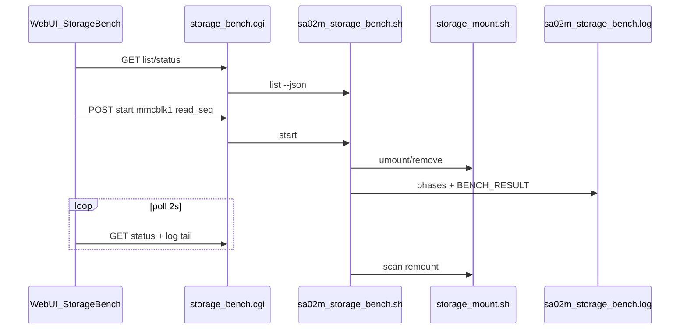

# План: тестирование microSD и USB из веб-интерфейса

**Статус: НЕ РЕАЛИЗОВАН (черновик от 2026-07-04).** Ни `etc/sa02m-storage-bench.sh`,
ни `www/network_config/cgi-bin/storage_bench.cgi` в дереве не появились; вкладки
«Тест накопителя» нет. Документ сохранён как готовая проработка сценария на
случай, если фича вернётся в работу — читать его как замысел, а не как описание
существующего поведения. Дальнейшая судьба ведётся в `.ai-dev/backlog.md`.

Версия плана: 2026-07-04  
Целевая ветка: `1.0.3.35+`  
Эталон сценария: bash-скрипт с `fdisk`, `fsck.vfat`, `dd`, `hdparm`, `flashbench`.

---

## Цель

Добавить в **Управление → Тест накопителя** диагностику и бенчмарк **microSD** (`mmcblk1/3`) и **USB-флешек** (`sd*`), без риска для **eMMC `mmcblk2`** (корень системы).

**Политика записи:** по умолчанию только **чтение**; деструктивные `dd write` — отдельный режим с жёстким подтверждением (`DESTROY` + второй confirm).

---

## Контекст в проекте

| Компонент | Роль |
|-----------|------|
| [`etc/storage-mount.sh`](../etc/storage-mount.sh) | USB → `/media/usb`, microSD → `/media/sdcard`; кандидаты: `mmcblk1/3`, USB `sd*` |
| [`www/network_config/cgi-bin/status.cgi`](../www/network_config/cgi-bin/status.cgi) | `part=storage`: `usb_mounted`, `sd_mounted`, объёмы |
| Дашборд | виджеты USB / microSD в [`www/network_config/index.html`](../www/network_config/index.html) |
| eMMC | **`mmcblk2`** — корень `/`, **никогда не тестировать** |

В репозитории пока **нет** использования `flashbench`, `hdparm`, `fsck.vfat` — пакеты добавить в install (с graceful skip, если пакета нет).

---

## Архитектура



**Паттерны проекта:**
- фоновый job + лог — как [`log.cgi`](../www/network_config/cgi-bin/log.cgi);
- sudo + JSON POST — как [`kernel_ctrl.cgi`](../www/network_config/cgi-bin/kernel_ctrl.cgi);
- парсинг POST через temp file — как [`services_ctrl.cgi`](../www/network_config/cgi-bin/services_ctrl.cgi).

---

## Фаза 1: скрипт `sa02m-storage-bench.sh`

**Файл:** [`etc/sa02m-storage-bench.sh`](../etc/sa02m-storage-bench.sh) → `/usr/local/sbin/sa02m-storage-bench.sh`

### Allowlist (fail-closed)

**Разрешены:**
- `mmcblk1`, `mmcblk3` (для `dd` / `hdparm` / `flashbench` — **целый** диск `mmcblkN`);
- `sd[a-z]` только если `removable=1` или USB (`is_usb_candidate` из `storage-mount.sh`).

**Запрещены:**
- `mmcblk2`, `mmcblk0`, `nvme*`;
- любой диск с точкой монтирования `/` или являющийся родителем root.

### Подкоманды

| Команда | Назначение |
|---------|------------|
| `list --json` | Список кандидатов: `id`, `type` (sdcard/usb), `size`, `mounted`, `model`, mmc metadata |
| `status --json` | `{running, device, profile, phase, started_at, exit_code}` |
| `start <dev> <profile> [--json]` | Старт фоновой сессии (`flock /run/sa02m-storage-bench.lock`) |
| `abort` | Остановка по PID из `/run/sa02m-storage-bench.pid` |
| `log [lines]` | tail лога для CGI |

### Профили тестов

| Profile ID | UI (RU) | Содержимое |
|------------|---------|------------|
| `info` | Быстрый (инфо) | MMC sysfs (`manfid`, `oemid`, `name`, `cid`, `csd`…), `fdisk -l`, `fsck.vfat -n -v` на p1 |
| `read_seq` | Чтение (seq) | 5× dd 4M count=10; 5× skip=10; 5× bs=64K skip=1024; `drop_caches` перед каждым |
| `read_adv` | Чтение + анализ | `read_seq` + 5× `hdparm -t` + flashbench (align/FAT/AU linear/random), если пакеты установлены |
| `write_destructive` | Запись (уничтожает данные!) | dd write из эталонного скрипта; только после confirm `DESTROY` в UI |

По умолчанию в вебе: **`info`** и **`read_seq`**.

### MMC metadata

Вместо `cd /sys/class/mmc_host/...` использовать:

```
/sys/block/mmcblkN/device/{manfid,oemid,name,hwrev,fwrev,date,cid,csd}
```

Для USB `sdX`: `udev` — `ID_VENDOR`, `ID_MODEL`, `ID_SERIAL`.

### Подготовка и завершение

1. Определить base device (`mmcblk1` vs `mmcblk1p1` — fsck на partition, dd на disk).
2. `storage-mount.sh remove` / `umount`.
3. `sync`.
4. Лог: `/var/log/sa02m-storage-bench.log`.
5. После теста: `storage-mount.sh scan` (best-effort remount).

### Парсинг скорости

Из вывода `dd` извлекать MB/s; в лог писать:

```
BENCH_RESULT phase=read_4m avg_mbps=42.3
```

`status --json` парсит последние `BENCH_RESULT` для UI.

### Зависимости (install)

| Пакет | Назначение | Обязательность |
|-------|------------|----------------|
| `dosfstools` | `fsck.vfat` | обязательно |
| `util-linux` | `fdisk`, `lsblk` | обычно есть |
| `hdparm` | `-t` throughput | optional |
| `flashbench` | align/FAT/AU | optional |

---

## Фаза 2: Web API

**CGI:** `www/network_config/cgi-bin/storage_bench.cgi`

| Method | Действие |
|--------|----------|
| GET | `list` / `status` / `log?lines=80` |
| POST | `{ "action": "start", "device": "mmcblk1", "profile": "read_seq" }` или `{ "action": "abort" }` |

**sudoers** ([`scripts/03-webserver.sh`](../scripts/03-webserver.sh)):

```
www-data ALL=(ALL) NOPASSWD: /usr/local/sbin/sa02m-storage-bench.sh list --json
www-data ALL=(ALL) NOPASSWD: /usr/local/sbin/sa02m-storage-bench.sh status --json
www-data ALL=(ALL) NOPASSWD: /usr/local/sbin/sa02m-storage-bench.sh start *
www-data ALL=(ALL) NOPASSWD: /usr/local/sbin/sa02m-storage-bench.sh abort
www-data ALL=(ALL) NOPASSWD: /usr/local/sbin/sa02m-storage-bench.sh log *
```

**Опционально** в `status.cgi` (`part=storage`):
- `storage_bench_running`, `storage_bench_device` — badge на дашборде.

---

## Фаза 3: UI

**Размещение:** [`www/network_config/index.html`](../www/network_config/index.html) `#tab-system` — плитка **«Тест накопителя»** (рядом с USB autoformat / ядро / CPU).

**Элементы:**
- `<select id="bench-device-select">` — из `list`;
- `<select id="bench-profile-select">` — info / read_seq / read_adv / write_destructive;
- кнопки: **Старт**, **Стоп**, **Обновить список**;
- `<pre id="bench-log-output">` — poll каждые 2 с при `running`;
- сводка MB/s по фазам;
- hint: «Тест снимает монтирование; eMMC не тестируется».

**JS** ([`app.js`](../www/network_config/static/js/app.js)):
- `loadStorageBench()` при открытии tab-system;
- `startStorageBench()` — для `write_destructive`: confirm + prompt `DESTROY`;
- `pollStorageBench()` — interval пока `running`;
- i18n в [`i18n.js`](../www/network_config/static/js/i18n.js).

**v1.1 (опционально):** кнопка «Тест» в виджете microSD/USB на дашборде → tab-system с preselected device.

---

## Фаза 4: Безопасность

| Риск | Mitigation |
|------|------------|
| Тест eMMC → brick | Hard deny `mmcblk2`; verify `root_disk_device` |
| Запись стирает exFAT | `write_destructive` только с двойным confirm |
| Долгий тест блокирует CGI | Фоновый bash + flock |
| USB-модем как `sd*` | `is_usb_candidate` + exclude if net iface |
| Параллель с autoformat | flock; отклонять start если bench busy |
| После теста нет mount | `storage-mount.sh scan` в конце скрипта |

---

## Фаза 5: Документация и тест-план

Обновить после реализации:
- [`CHANGELOG.md`](../CHANGELOG.md);
- [`docs/bugs/BUGLOG.md`](bugs/BUGLOG.md);
- краткая секция в [`README.md`](../README.md).

### Тест-план на устройстве

| Шаг | Ожидание |
|-----|----------|
| Без SD/USB | `list` пуст или только USB |
| microSD вставлена | `mmcblk1` в list, metadata cid/name |
| `profile=info` | fdisk + fsck -n, без записи |
| `profile=read_seq` | dd MB/s в лог, remount после scan |
| Попытка `mmcblk2` | `error=forbidden_device` |
| `write_destructive` без confirm | UI блокирует |
| abort во время dd | процесс остановлен, lock снят |

---

## Объём файлов (итог реализации)

| Файл | Действие |
|------|----------|
| `etc/sa02m-storage-bench.sh` | новый |
| `www/network_config/cgi-bin/storage_bench.cgi` | новый |
| `www/network_config/index.html` | плитка |
| `www/network_config/static/js/app.js` | UI + poll |
| `www/network_config/static/css/main.css` | стили |
| `www/network_config/cgi-bin/status.cgi` | optional bench status |
| `scripts/03-webserver.sh` | install, sudoers |
| `scripts/01-system.sh` | dosfstools, hdparm (optional) |
| `etc/logrotate.d/sa02m-storage-bench` | ротация лога |

**Вне scope v1:**
- Bonnie++;
- тест через смонтированный `/media/usb` (только raw block device, как в эталонном скрипте).

---

## Эталонный сценарий (исходный скрипт)

Ниже — фазы, которые ложатся в профили `info` / `read_seq` / `read_adv` / `write_destructive`:

```bash
# MMC info
cd /sys/class/mmc_host/mmc*/mmc*\:*
echo "man:$(cat manfid) oem:$(cat oemid) name:$(cat name) ..."

# Partition + FAT check (read-only)
sudo fdisk -l ${DEVICE}
sudo fsck.vfat -n -v ${PART}

# Sequential read (dd + drop_caches)
sudo dd if=${DEVICE} bs=4M count=10 of=/dev/null
# ... skip variants, 64K blocks ...

# Sequential write (DESTRUCTIVE — только write_destructive)
sudo dd if=/dev/zero of=${DEVICE} bs=4M count=10 conv=fdatasync

# hdparm, flashbench align/FAT/AU
sudo hdparm -t ${DEVICE}
sudo flashbench -a ${DEVICE} -b 1024 -c 50
# ... open-au linear/random ...
```

В реализации SA-02m путь MMC заменяется на `/sys/block/mmcblkN/device/`, а запись вынесена в отдельный защищённый профиль.
